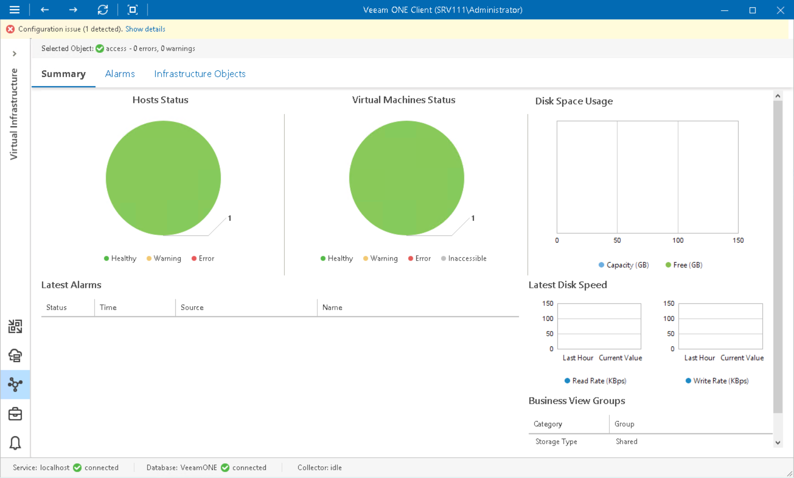

# SMB Share Summary

The SMB shares summary dashboard provides the health status and performance overview for the selected SMB share. In addition, it shows the state of objects that can affect SMB share performance — hosts that work with SMB shares and VMs residing on the shares.

Hosts Status, Virtual Machines Status

The charts reflect the health status of the hosts that work with the SMB share and VMs located on the share.

Every chart segment represents the number of objects with a certain status — objects with errors (red), objects with warnings (yellow) and healthy objects (green). Click a chart segment or a legend label to drill down to the list of alarms with the corresponding status for hosts or VMs.

Disk Space Usage

The chart reflects the amount of available and used disk space on the SMB share.

Latest Alarms

The list displays the latest 15 alarms for the SMB share and alarms for hosts that work with the file share and for VMs located on the share. Click a link in the Source column to drill down to the list of alarms for the selected object.

For more information, see [Working with Triggered Alarms](triggered_alarms.md).

Latest Disk Speed

The section displays the current read and write rate as well as the average read and write rate values for the past hour.

Page updated 2026-07-31

