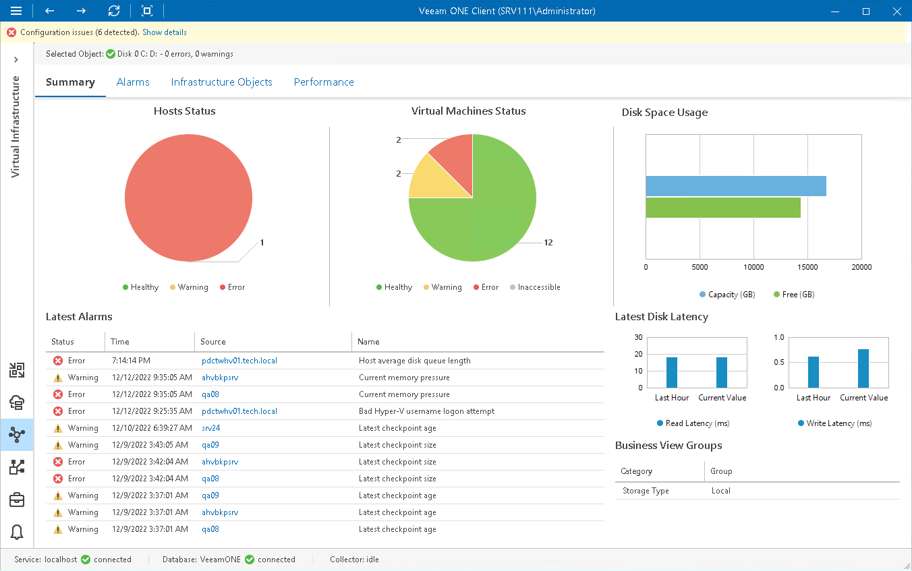

# Local Storage Summary

The local storage summary dashboard provides the health status and performance overview for the selected host local storage. In addition, it shows the state of objects that can affect the storage performance — the parent host and VMs on the local storage.

Hosts Status, Virtual Machines Status

The charts reflect the health status of the host and VMs that work with the local storage.

Every chart segment represents the number of objects in a certain state — objects with errors (red), objects with warnings (yellow) and healthy objects (green). Click a chart segment or a legend label to drill down to the list of alarms with the corresponding status for hosts or VMs.

Disk Space Usage

The chart reflects the amount of available and used disk space on the local storage.

Latest Alarms

The list displays the latest 15 for the local storage and objects that work with the local storage. Click a link in the Source column to drill down to the list of alarms for the selected object.

For more information, see [Working with Triggered Alarms](triggered_alarms.md).

Latest Disk Latency

The section displays the current read and write latency values as well as the average latency values for the past hour.

Business View Groups

The section displays the list of categories and groups to which the storage is included.

