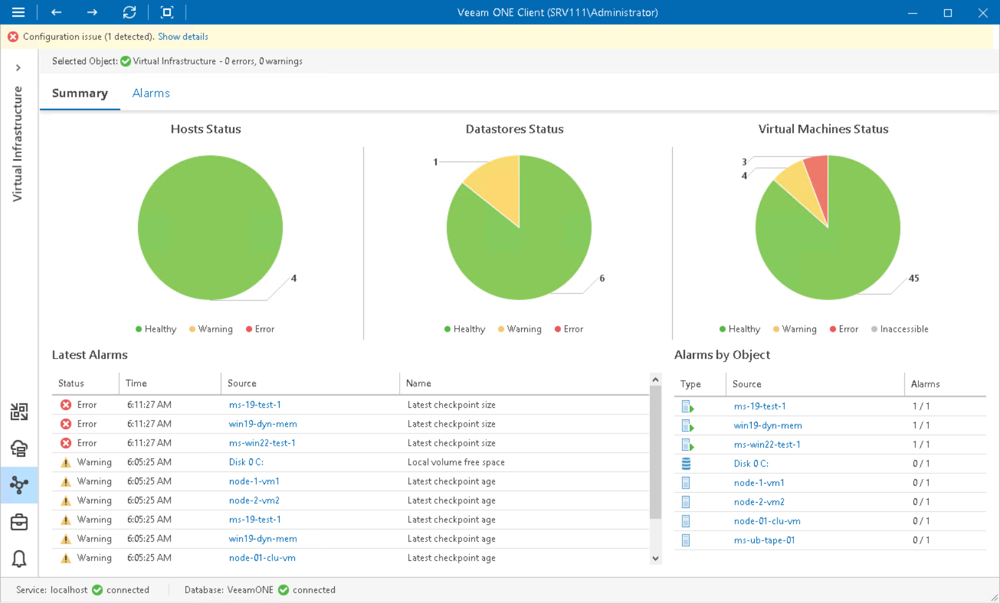

# Microsoft Hyper-V Infrastructure Summary

The Hyper-V infrastructure summary dashboard provides the health status overview for the selected virtual environment segment.

The dashboard is available for the following infrastructure levels:

* Virtual infrastructure (root node)
* Virtual infrastructure container (such as SCVMM, cluster or storage container)

Hosts Status, Datastores Status, Virtual Machines Status

The charts reflect the status of virtual infrastructure objects.

Every chart segment represents the number of objects with a certain status — objects with errors (red), objects with warnings (yellow) and healthy objects (green). Click a chart segment or a legend label to drill down to the list of alarms with the corresponding status for the selected type of virtual infrastructure objects.

Latest Alarms

The list displays the latest 15 alarms that were triggered for objects in the selected virtual environment segment. Click a link in the Source column to drill down to the list of alarms triggered for a specific virtual infrastructure object.

Alarms by Object

The list displays 15 objects with the highest number of alarms.

The value in the Alarms column shows the number of errors and warnings for an object. For example, 3/1 means that there are 3 error alarms and 1 warning alarm triggered for the object. Click a link in the Source column to drill down to the list of alarms related to a specific virtual infrastructure object.

For more information, see [Working with Triggered Alarms](triggered_alarms.md).

Business View Groups

The section displays the list of categories and groups to which the cluster is included.

Page updated 2026-08-03

