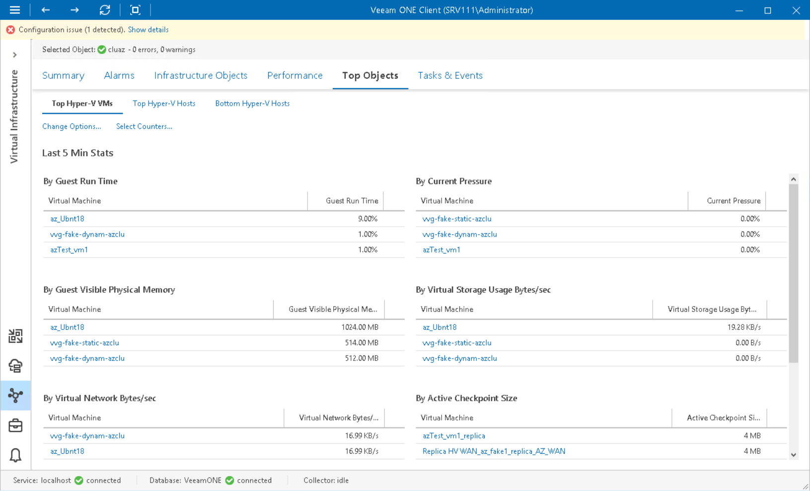

# Microsoft Hyper-V Top Objects

The top and lowest load dashboards help you detect VMs and hosts consuming the greatest or the smallest amount of resources in the selected virtual infrastructure segment.

* Top Hyper-V VMs dashboard displays top VM consumers in terms of CPU, memory, storage, network usage, snapshot age and size.
* Top Hyper-V Hosts dashboard displays top hosts in terms of CPU, memory, disk and network usage.
* Bottom Hyper-V Hosts dashboard displays least loaded hosts in terms of CPU, memory, disk and network resource usage.

You can use this dashboard to choose hosts where you can deploy new VMs or to which you can move existing VMs.

To detect the most or least loaded hosts or VMs:

1. Open Veeam ONE Client.

For details, see [Accessing Veeam ONE Components](access.md).

1. At the bottom of the inventory pane, click Virtual Infrastructure.
2. In the inventory pane, select the necessary infrastructure container.
3. Open the Top Objects tab and navigate to necessary dashboard — Top Hyper-V VMs, Top Hyper-V Hosts or Bottom Hyper-V Hosts.
4. Click the Change Options link in the top left corner of the dashboard.

* In the Interval field, set the time interval for which resource utilization statistics must be analyzed.
* In the VMs to display/Hosts to display field, define the number of objects to display on the dashboard.

1. Click the Select Counters link in the top left right corner of the dashboard.

1. In the Select counters window, choose metrics that must be included in the dashboard. Press and hold the [SHIFT] or [CTRL] key on the keyboard to select multiple counters.
2. Click OK.

