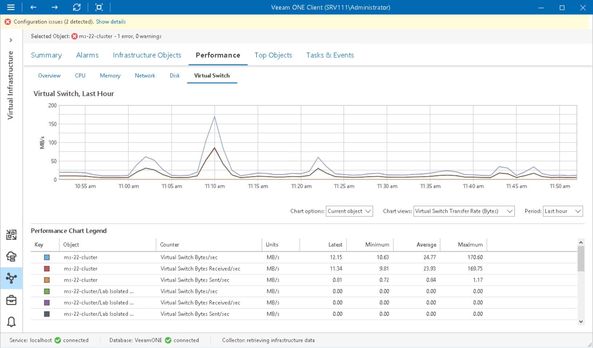

# Virtual Switch Performance Chart

The Virtual Switch chart displays historical statistics on virtual switch usage for Microsoft Hyper-V hosts.

The following table provides information on predefined views and counters.

Virtual Switch Performance Chart

| Chart View | Counter | Measurement Unit | Description |
| Virtual Switch Transfer Rate (Bytes) | Virtual Switch Bytes Received/sec | KB/s | Amount of data received per second by a virtual switch. |
| Virtual Switch Bytes Sent/sec | KB/s | Amount of data sent per second by a virtual switch. |
| Virtual Switch Bytes/sec | KB/s | Amount of data received and sent per second by a virtual switch. |
| Virtual Switch Transfer Rate (Packets) | Virtual Switch Packets Received/sec | Number | Total number of packets received per second by a virtual switch. |
| Virtual Switch Packets Sent/sec | Number | Total number of packets sent per second by a virtual switch. |
| Virtual Switch Packets/sec | Number | Total number of packets received and sent per second by a virtual switch. |

