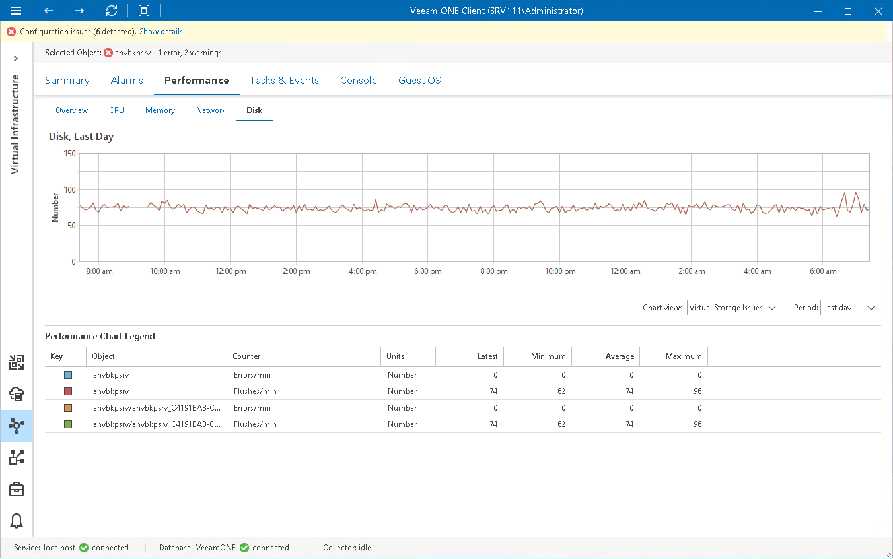

# VM Disk Performance Chart

The Disk chart for VMs displays historical statistics for partitions of all disks on the selected VM.

The following table provides information on predefined views and counters.

VM Disk Performance Chart

| Chart View | Counter | Measurement Unit | Description |
| Virtual Storage Issues | Errors/min | Number | Number of virtual storage errors per minute. |
| Flushes/min | Number | Number of virtual storage flush operations per minute. |
| Virtual Storage Usage | Virtual Storage Read | KB/s | Total number of bytes that have been read per second on a virtual storage. |
| Virtual Storage Write | KB/s | Total number of bytes that have been written per second on a virtual storage. |
| Virtual Storage Usage | KB/s | Rate at which bytes have been read and written per second on a virtual storage. |
| Virtual Storage IOPS | IOPS | Number | Average number of read and write operations per second to a virtual storage. |
| Reads/sec | Number | Total number of read operations issued per second to a virtual storage. |
| Writes/sec | Number | Total number of write operations issued per second to a virtual storage. |

