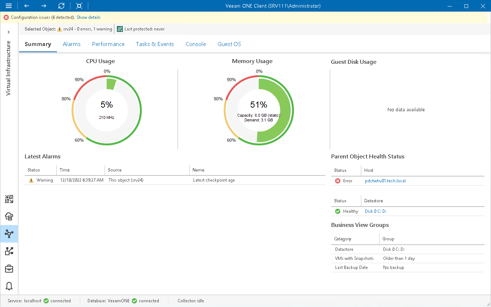

# Virtual Machine Summary

The VM summary dashboard provides the health status and performance overview for the selected VM. In addition, this dashboard shows the status of objects that can affect the VM performance — the parent host and the volumes where VM files are located.

Selected Object

The section at the top of the dashboard shows the VM health status (number of warnings and errors) and the date when the latest backup or replica restore point was created for the VM with Veeam Backup & Replication.

CPU Usage, Memory Usage

The charts display the amount of CPU and memory resources currently consumed by the VM.

|  |
| --- |
| Note: |
| * On Hyper-V hosts prior to version 2016, memory usage is shown as 100% for VMs with Static Memory. * For Microsoft SQL Server or Exchange VMs running on Hyper-V 2016 hosts, memory usage can be shown to exceed 100%. * Veeam ONE is not currently able to collect guest disk space usage data from Linux VMs running in a Hyper-V environment. |

Guest Disk Usage

The chart displays the amount of available and used guest disk space with a breakdown by disks. By default, 5 guest disks with the greatest amount of used space are displayed.

Use the Disks to show list to change the number of disks to display on the chart. Click the View all disks link to view details for all guest disks. In the Guests Disks window, you can suppress Guest disk space alarms for specific disks. To suppress alarms for a disk, select the Suppress alarms check boxes next to the disk name.

Parent Object Health Status

The section displays the current state of the host where the VM resides and the state of volumes that host VMs files. Information in this section may help you to estimate the impact of parent objects on the VM performance. Click the host or volume name link to drill down to the list of alarms for the host or volume.

Latest Alarms

The list displays the latest 15 alarms for the VM.

For more information, see [Working with Triggered Alarms](triggered_alarms.md).

Business View Groups

The section displays the list of categories and groups to which the VM is included.

