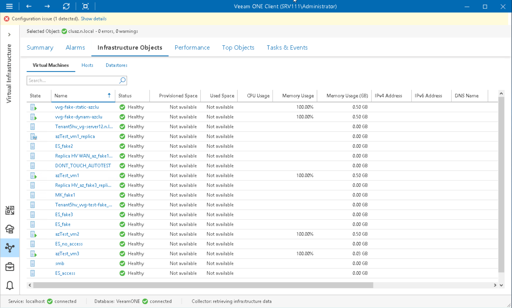

# Microsoft Hyper-V Virtual Machines

You can view the list of VMs within a virtual infrastructure container — on a host, on a volume, in a folder and so on.

To view the list of VMs:

1. Open Veeam ONE Client.

For details, see [Accessing Veeam ONE Components](access.md).

1. At the bottom of the inventory pane, click Virtual Infrastructure.
2. In the inventory pane, select the necessary infrastructure container.
3. Open the Infrastructure Objects tab and navigate to Virtual Machines.
4. To find the necessary VM by name, use the Search field at the top of the list.
5. Click column names to sort VMs by a specific parameter.

For example, to view what VMs are consuming the greatest amount of memory, you can sort VMs in the list by Memory Usage.

For every virtual machine in the list, the following details are available:

* State — state of the virtual machine (powered on, powered off, saved, paused)
* Name — name of the virtual machine
* Status — current status of the virtual machine in terms of alarms (healthy, warning or error)
* Host — name of the host where the virtual machine resides
* Provisioned Space — amount of storage space provisioned for the virtual machine
* Used Space — amount of storage space actually used for storing virtual machine files (for VMs with thin provisioned disks, this value is normally less than Provisioned Space)
* CPU Usage — amount of actively used virtual CPU as a percentage of total available CPU resources
* Memory Usage — amount of actively used memory resources as a percentage of configured VM memory
* Memory Usage (GB) — amount of actively used memory resources in GB
* IP V4 Address — IP V4 address assigned to the virtual machine
* IP V6 Address — IP V6 address assigned to the virtual machine
* DNS Name — DNS name of the virtual machine
* vCPU — number of virtual CPUs configured for the virtual machine
* Assigned Memory — amount of virtual memory allocated for the virtual machine
* Guest OS — guest operating system installed in the virtual machine
* Integration Services — number and state of Hyper-V Integration Services installed in the guest OS

You can choose what columns to show or hide in the Virtual Machines table:

* To hide one or more columns, right-click the table header and clear check boxes for corresponding data fields.
* To make hidden columns visible, right-click the table header and select check boxes for corresponding data fields.

