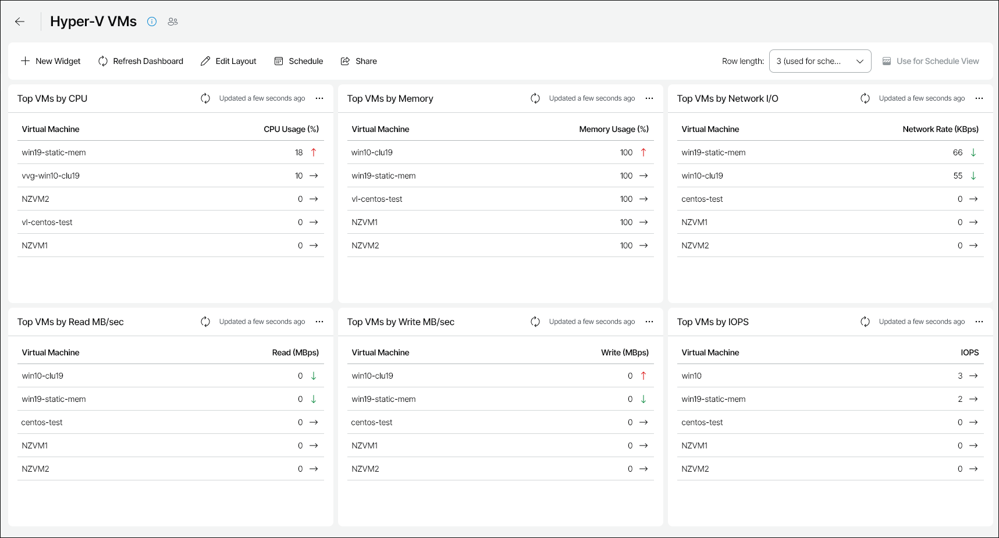

# Hyper-V VMs

The Hyper-V VMs dashboard provides information about health and performance of VMs in the Microsoft Hyper-V infrastructure, and shows general VM statistics on CPU, memory and network usage for the past week.

You can access the Hyper-V VMs dashboard from the Dashboard tab in Veeam ONE Web Client.

Widgets Included

Top VMs by CPU

This widget displays a list of VMs with the highest average level of CPU utilization.

Arrows on the right show whether the CPU usage value has changed over the previous week\*.

Top VMs by Memory

This widget displays a list of VMs with the highest average level of memory utilization. The memory utilization value is calculated as a percentage of total memory allocated for the VM.

Arrows on the right show whether the memory utilization value has changed over the previous week\*.

Top VMs by Network I/O

This widget displays a list of VMs with the highest average network throughput values.

Arrows on the right show whether the throughput value has changed over the previous week\*.

Top VMs by Read MB/sec

This widget displays a list of VMs with the highest average Read metric values.

Arrows on the right show whether the average read latency value has changed over the previous week\*.

Top VMs by Write MB/sec

This widget displays a list of VMs with the highest average Write metric values.

Arrows on the right show whether the average write latency value has changed over the previous week\*.

Top VMs by IOPs

This widget displays a list of VMs with the highest average number of IOPS.

Arrows on the right show whether the number of IOPS has changed over the previous week\*.

\*The arrows allow you to compare the results of this week to the results of the previous week, and to track how the trend has evolved. For example, a grey arrow pointing right next to the CPU Usage value means that CPU utilization has not changed over the past week, a green arrow pointing down means that CPU utilization has decreased, while a red arrow pointing up means that CPU utilization has increased.

