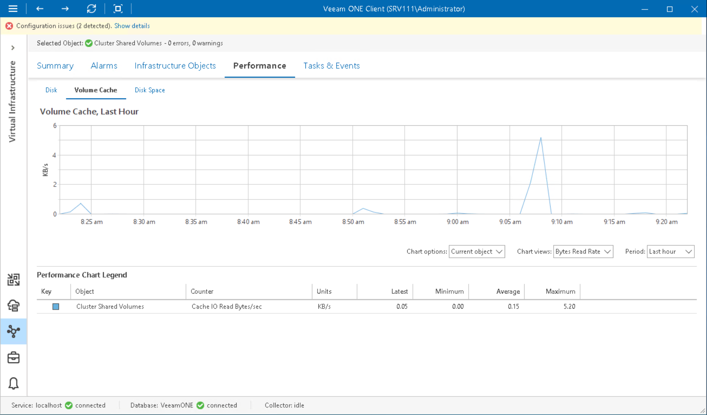

# Volume Cache Performance Chart

The Volume Cache chart displays historical statistics on read requests from the cache for the selected Cluster Shared Volume with enabled CSV Cache.

The following table includes information on predefined views and counters.

Volume Cache Performance Chart

| Chart View | Counter | Measurement Unit | Description |
| Bytes Read Rate | Cache IO Read | MB/s | Rate at which data is transferred from the volume cache during read operations. |
| Total Read | Cache Reads/sec | Number | Number of read operations performed in the volume cache per second. |

Page updated 2026-08-07

