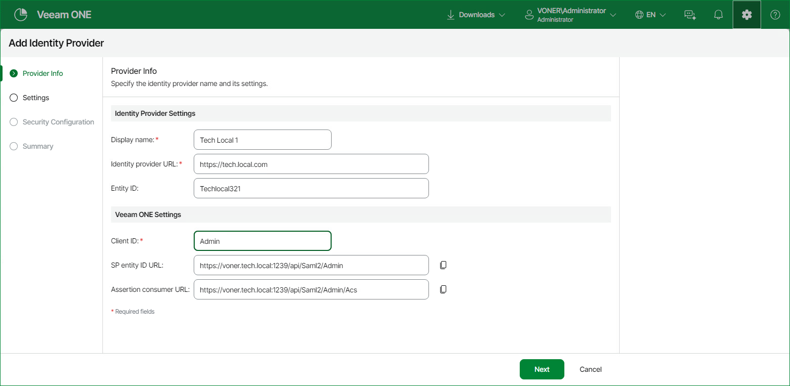
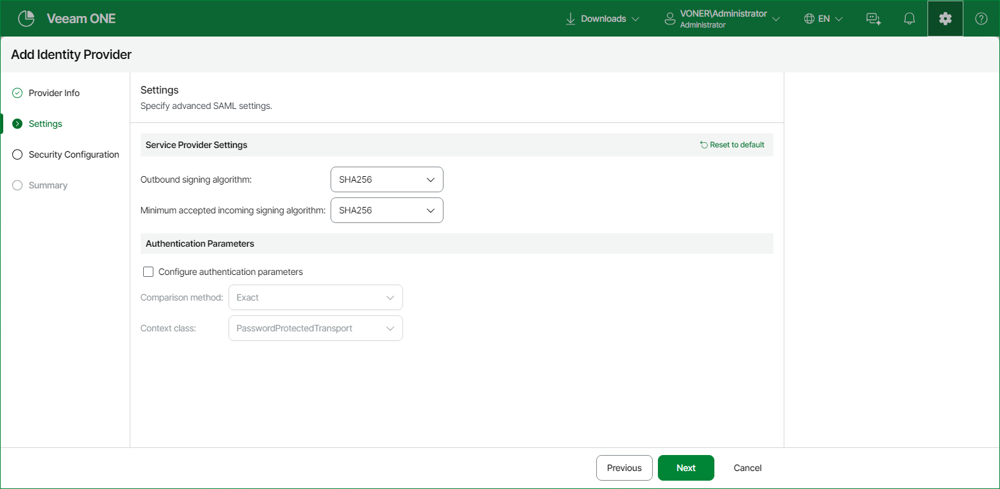
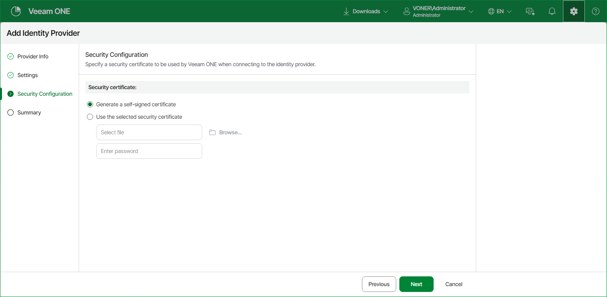
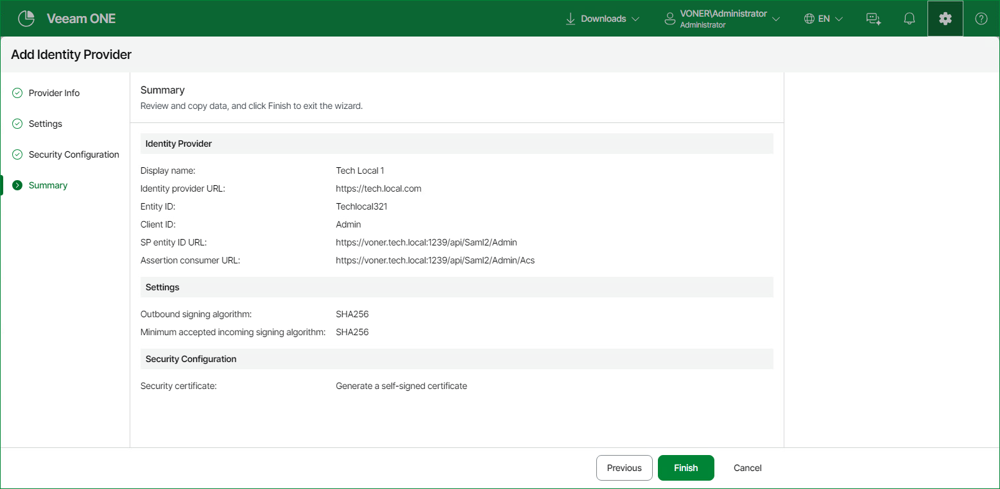
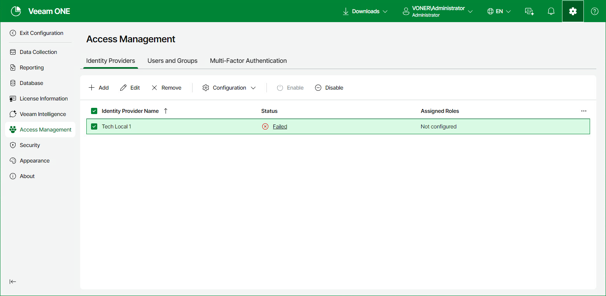

# Managing Identity Providers

Veeam ONE allows you to create and manage identity provider configurations to set up single sign-on (SSO) using SAML.

To configure identity providers, you must have the administrator role assigned on the relevant identity provider platform.

Adding Identity Providers

You can add identity providers (IdP) to allow users to log in to Veeam ONE using external authentication services. SAML authentication requires a service provider (SP) to set up a trust relationship with an identity provider (IdP). To do that, you must create an IdP configuration in Veeam ONE.

To add an identity provider:

1. Open Veeam ONE Web Client.

For details, see [Accessing Veeam ONE Components](access.md).

1. At the top right corner of the Veeam ONE Web Client window, click Configuration.
2. In the configuration menu on the left, click Access Management.
3. On the Identity Providers tab, click Add to open the Add Identity Provider wizard.
4. At the Provider info step of the wizard, define:

* Identity Provider Settings:

* Display name — specify a friendly name that will be displayed for this identity provider in Veeam ONE.
* Identity provider URL — specify the metadata URL of the identity provider that will be used to retrieve its SAML configuration.
* Entity ID — for Okta, Keycloak and Custom identity providers, specify the unique ID of the identity provider.

* Veeam ONE Settings:

* Client ID — specify the name of the client created for Veeam ONE on the identity provider side.
* SP entity ID URL — a read-only URL that Veeam ONE generates to identify itself as a service provider to the identity provider. You can copy it to configure the identity provider.

* Assertion consumer URL — a read-only URL that Veeam ONE generates as the endpoint where the identity provider sends authentication responses. You can copy it to configure the identity provide.

1. At the Settings step of the Add Identity Provider wizard, specify the following:

* Service Provider Settings — specify the following, or click Reset to default to restore the default values:

* Outbound signing algorithm — select from SHA256, SHA384 or SHA512.
* Minimum accepted incoming signing algorithm — select from SHA256, SHA384 or SHA512.

* Authentication Parameters — select the Configure authentication parameters check box to specify:

* Comparison method — the rule the identity provider applies when matching the authentication it performed against the requested Context class. Select from Exact, Minimum, Maximum or Better.

* Context class — the SAML authentication context the identity provider must satisfy. Select a value from the list. For details on each value, see the [SAML 2.0 authentication context specification](http://docs.oasis-open.org/security/saml/v2.0/saml-authn-context-2.0-os.pdf).

1. At the Security Configuration step of the wizard, select either of the following options for a security certificate that will be used by Veeam ONE to connect to the IdP:

* Generate a self-signed certificate — Veeam ONE generates a new self-signed certificate automatically.
* Use the selected security certificate — upload a certificate in the PKCS#12 format from your local disk or file share and provide the certificate password.

1. At the Summary step of the wizard, review the configuration settings and click Finish.

Editing Identity Providers

You can edit an existing identity provider to change its configuration.

To edit an identity provider:

1. Open Veeam ONE Web Client.

For details, see [Accessing Veeam ONE Components](access.md).

1. At the top right corner of the Veeam ONE Web Client window, click Configuration.
2. In the configuration menu on the left, click Access Management.
3. On the Identity Providers tab, select the identity provider you want to edit.
4. Click Edit.
5. In the Edit Identity Provider wizard, change the settings as required and click Finish.

Removing Identity Providers

You can remove identity providers configured in Veeam ONE. Note that when you remove an identity provider, all user identities associated with it become unavailable until you remap them.

To remove an identity provider:

1. Open Veeam ONE Web Client.

For details, see [Accessing Veeam ONE Components](access.md).

1. At the top right corner of the Veeam ONE Web Client window, click Configuration.
2. In the configuration menu on the left, click Access Management.
3. On the Identity Providers tab, select the identity provider you want to remove.
4. Click Remove.

Updating Identity Provider Configuration

You can update an identity provider configuration in Veeam ONE. This can be useful if changes were applied to the identity provider server and you must the Veeam ONE configuration with these changes. You can also download configuration metadata to troubleshoot issues.

To update an identity provider configuration:

1. Open Veeam ONE Web Client.

For details, see [Accessing Veeam ONE Components](access.md).

1. At the top right corner of the Veeam ONE Web Client window, click Configuration.
2. In the configuration menu on the left, click Access Management.
3. On the Identity Providers tab, select the identity provider whose configuration you want to update.
4. From the Configuration drop-down list, select Resync Configuration.
5. [Optional] Click Download Metadata File to save a metadata file for support purposes.
6. [Optional] Click Test Login to test the updated configuration.

Enabling or Disabling Identity Providers

You can temporarily disable an identity provider when required for maintenance or troubleshooting, and re-enable it when ready. To enable or disable an identity provider:

1. Open Veeam ONE Web Client.

For details, see [Accessing Veeam ONE Components](access.md).

1. At the top right corner of the Veeam ONE Web Client window, click Configuration.
2. In the configuration menu on the left, click Access Management.
3. On the Identity Providers tab, select the identity provider you want to enable or disable.
4. Click Enable or Disable.

Page updated 2026-08-07

