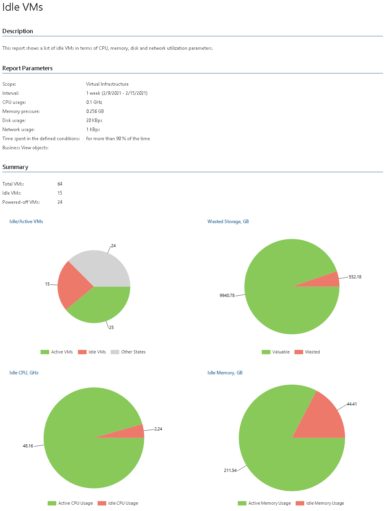
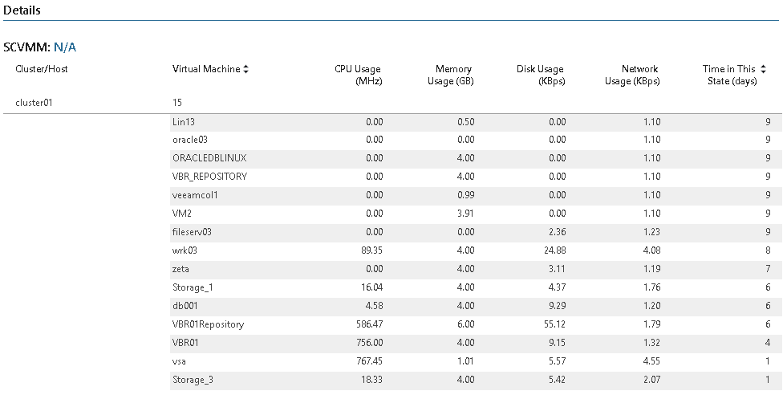

# Idle VMs (Hyper-V)

Idle VMs are virtual machines that continue to operate even though they are no longer in use. These Idle VMs keep consuming resources and provide no value.

* The Summary section includes the following elements:

+ The Idle/Active VMs chart shows the number of idle and active VMs.
+ The Wasted Storage, GB chart shows the amount of valuable and wasted storage resources.
+ The Idle CPU, GHz and Idle Memory, GB charts show the amount of active and idle CPU and memory resources.

* The Details table provides information on idle VMs, including cluster or host name, VM name, CPU, memory, disk and network usage, and the number of days during which VM was inactive.

Report Parameters

You can specify the following report parameters:

* Infrastructure objects: defines a virtual infrastructure level and its sub-components to analyze in the report.
* Business View objects: defines Veeam Backup & Replication groups to analyze in the report. The parameter options are limited to objects of the Virtual Machine type.

Business View groups from the same category are joined using Boolean OR operator, Business View groups from different categories are joined using Boolean AND operator. That is, if you select groups from the same category, the report will contain all objects that are included in groups. However, if you select groups from different categories, the report will contain only objects that are included in all selected groups.

* Period: defines the time period to analyze in the report. Note that the reporting period must include at least one successfully completed Object properties data collection task for the selected scope. Otherwise, the report will contain no data.
* CPU usage, less than: defines a CPU usage threshold. If the average CPU usage for a VM is below the threshold during a certain number of days (specified with the Time in the selected state parameter), the VM will be considered “Idle”.
* Memory pressure, less than: defines memory usage threshold. If the average memory usage for a VM is below the threshold during a certain number of days (specified with the Time in the selected state parameter), the VM will be considered “Idle”.
* Disk usage, less than: defines a disk usage threshold. If the average disk usage for a VM is below the threshold during a certain number of days (specified with the Time in the selected state parameter), the VM will be considered “Idle”.
* Network usage, less than: defines a network usage threshold. If the average network usage for a VM is below the threshold during a certain number of days (defined by Time in the selected state), the VM will be considered “Idle”.
* Time spent in the defined conditions: defines the percentage of days in the reporting period when the average resource usage (CPU, Memory, Disk and Network) of the VM was below the selected thresholds.

|  |
| --- |
| Note: |
| Veeam ONE Web Client checks whether the CPU usage, Memory pressure, Disk usage and Network usage conditions are all true (in other words, the conditions are joined by Boolean “AND”). |

Use Case

This report can help you track VMs that can be shut down or decommissioned to reclaim resources and improve performance of your virtual infrastructure.

