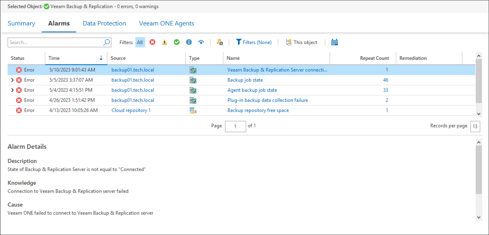

# Information Pane

The information pane is the main working area used for managing alarms, viewing performance data and accomplishing other operations for monitoring your virtual and data protection environment.

Tabs in the information pane allow you to switch between Veeam ONE Client dashboards. The set of available dashboards varies depending on the object selected in the inventory tree.

