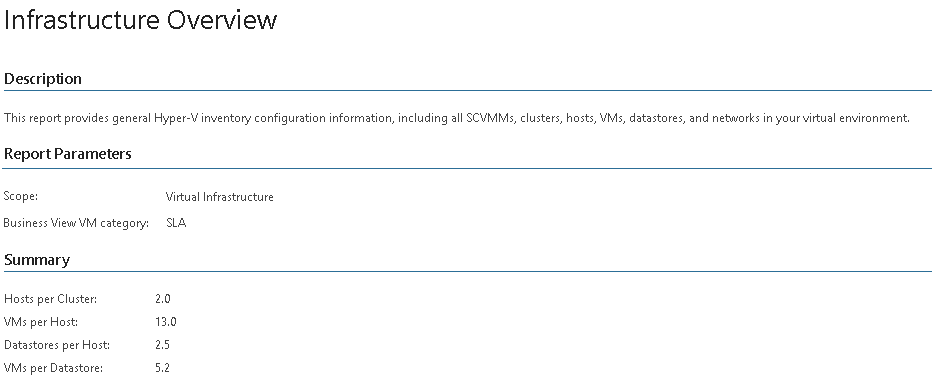

# Infrastructure Overview (Hyper-V)

This report reveals the necessary Hyper-V inventory configuration specifics and allows you to evaluate the current state of your virtual environment.

The subsections provide detailed information on SCVMM servers, clusters, CSVs, SMB shares, local disks, host systems and networks. The report also includes charts that display percentage distribution of VM power states, Integration Services statuses and Business View groups across the infrastructure.

|  |
| --- |
| Tip: |
| * Click a SCVMM server name in the SCVMM Servers table to drill down to details on hypervisor version installed on the server and the list of hosts that run on the server. * Click the Details link below the Power State chart to drill down to the full list of VMs and their power states. * Click the Details link below the Integration Service Status chart to drill down to the full list of VMs and statuses of Integration Services running in these VMs. * Click the Details link below the BV Chart to drill down to the full list of Business View categories and VMs that belong to these categories. |

Report Parameters

You can specify the following report parameters:

* Infrastructure objects: defines a virtual infrastructure level and its sub-components to analyze in the report.
* Business View VM category: defines a Business View group that includes VMs to analyze in the report.

Use Case

The report helps administrators track the state of monitored virtual infrastructure.

