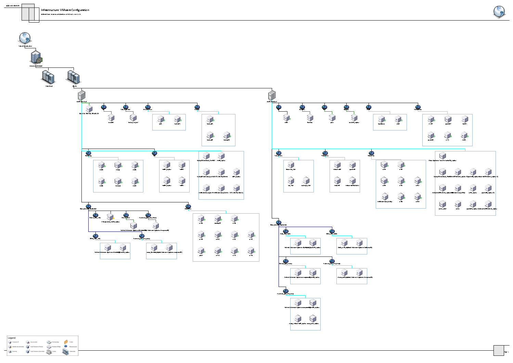
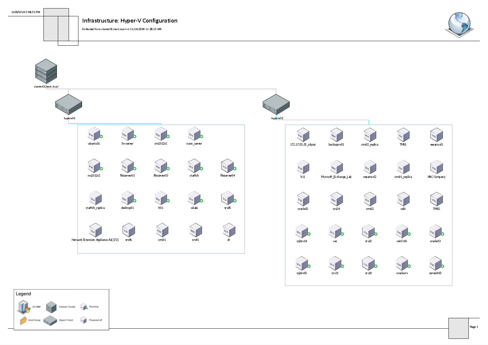

# Infrastructure Overview (Visio)

This report shows a diagram of the VMware vSphere and Microsoft Hyper-V infrastructure. The infrastructure is presented with a set of diagrams that illustrate different views, or inventories:

* Configuration inventory
* Storage inventory
* Network inventory (available for VMware vSphere only)
* Datastore Utilization (available for VMware vSphere only)
* vMotion (available for VMware vSphere only)

|  |
| --- |
| Note: |
| To view the report, you must have Microsoft Visio installed. |

Report Parameters

You can specify the following report parameters:

* Scope: defines a virtual infrastructure level and its sub-components to analyze in the report.
* Show VMs: defines whether to show VMs in the report.

Infrastructure: VMware Configuration

The following diagram displays VMware vSphere configuration inventory.

Infrastructure: Hyper-V Configuration

The following diagram displays Microsoft Hyper-V configuration inventory.

Use Case

The report includes a set of Microsoft Visio diagrams that show infrastructure configuration from different viewpoints.

This offline report provide details on major health and configuration properties. Advanced topology maps that are not available with other competing products provide automatically generated representation of your virtual infrastructure layout in a Visio format. To view this report offline, you must first install Veeam Report Viewer and

Installing Veeam Report Viewer

To view Veeam ONE offline reports, Veeam Report Viewer software is required.

To download and install Veeam Report Viewer:

1. Open Veeam ONE Web Client.
2. Open the Reports section.
3. In the hierarchy on the left, select Offline Reports.
4. In the list of offline reports, click any report.
5. In the information section, click the Veeam Report Viewer link.
6. Download the VmReportViewerSetup.msi installer file.
7. On the machine where you want to install the Veeam Report Viewer, launch the installer file to start the Veeam Report Viewer setup wizard.
8. Follow the steps of the setup wizard to install Veeam Report Viewer.

Viewing Offline Reports

To access and view offline reports:

1. In the list of offline reports, click the report.
2. Specify the report parameters.
3. Click Preview to generate a report file.

Veeam ONE Web Client will generate a file with the VMR extension and save it to the download location.

1. Open the downloaded file on the machine where Veeam Report Viewer is installed.

Veeam Report Viewer will process data in the VMR report and prepare the output. The output contains data viewable in Microsoft Visio. Make sure that you have Visio software to open report output files.

