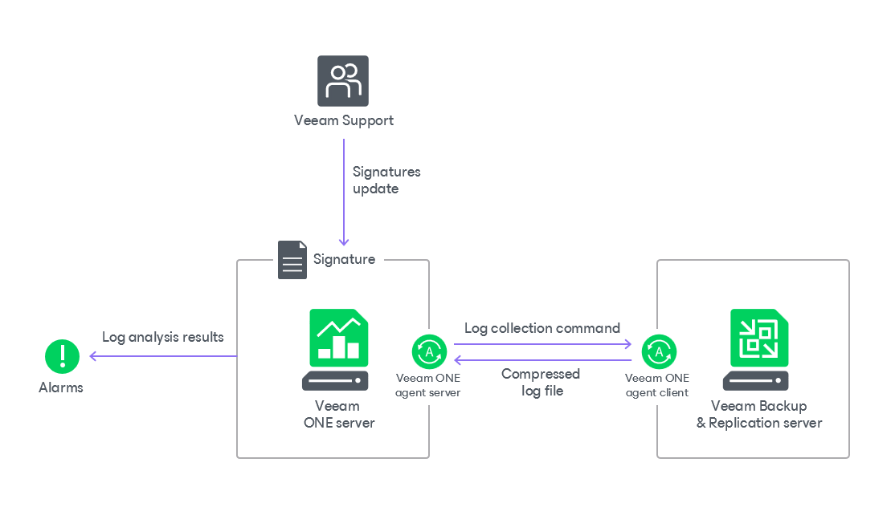

# Veeam Intelligent Diagnostics

Veeam Intelligent Diagnostics is a feature that allows you to automatically detect known issues in configuration and performance of backup infrastructure. It enables Veeam ONE to parse logs from Veeam Backup & Replication servers and trigger alarms with recommendations based on the results of log analysis. This allows you to eliminate configuration issues without the necessity to address Veeam Technical Support.

Veeam Intelligent Diagnostics process involves the following components:

* Signatures — problem definitions that are based on common issues investigated by Veeam Technical Support.

Signatures are stored in Veeam ONE database and displayed as Intelligent Diagnostics alarms in the Alarm Management view.

Signatures can be updated manually or automatically. For details on updating and importing signatures, see [Managing Signatures](manage_support_signatures.md).

* Veeam Analytics service — collects monitoring and reporting data and enables communication with Veeam Backup & Replication servers, performs collection of logs, and sends remediation commands.

|  |
| --- |
| Note: |
| It is recommended to install Veeam Analytics service to improve data collection performance in large-scale Veeam Backup & Replication infrastructures. |

Veeam Analytics service can work in the following modes:

* Server

In this mode, Veeam Analytics service is responsible for analyzing log data and signature updates.

Veeam Analytics service server is included into Veeam ONE installation package and deployed on the machine running Veeam ONE Server during product installation.

* Client

In this mode, Veeam Analytics service is responsible for collecting logs and executing remediation actions on Veeam Backup & Replication servers.

Veeam Analytics service client is deployed on Veeam Backup & Replication servers when you connect these servers to Veeam ONE. For details on managing client Veeam Analytics service, see [Managing Veeam Analytics Service](manage_one_agents.md).

|  |
| --- |
| Note: |
| For proper operation of Veeam Intelligent Diagnostics feature, Veeam Backup & Replication servers on which you deploy Veeam Analytics service must have a PowerShell module deployed. For details on Veeam Backup PowerShell module, see [Veeam PowerShell Reference](https://helpcenter.veeam.com/docs/backup/powershell/getting_started.html). |

How Veeam Intelligent Diagnostics Works

Veeam Intelligent Diagnostics works in the following way:

1. When Veeam Intelligent Diagnostics session starts, Veeam ONE Client sends a command to Veeam Analytics service client to collect logs from Veeam Backup & Replication.
2. Veeam Analytics service client creates a compressed log file and sends it to Veeam Analytics service server.
3. Veeam Analytics service server parses Veeam Backup & Replication logs for known exceptions and error messages by comparing logs with signatures.
4. If any known issues found, Veeam ONE Client triggers an alarm with recommendations and knowledge base articles from Veeam Technical Support.

How to Configure Veeam Intelligent Diagnostics

To configure Veeam Intelligent Diagnostics, perform the following steps:

1. Install Veeam Analytics service on Veeam Backup & Replication servers connected to Veeam ONE and configure agent settings.

For details, see [Managing Veeam ONE Agents](manage_one_agents.md).

1. Obtain an up-to-date version of signatures.

For details, see [Managing Signatures](manage_support_signatures.md).

1. Configure log analysis schedule or start log analysis session manually.

For details, see [Performing Log Analysis](vbr_log_analysis.md).

