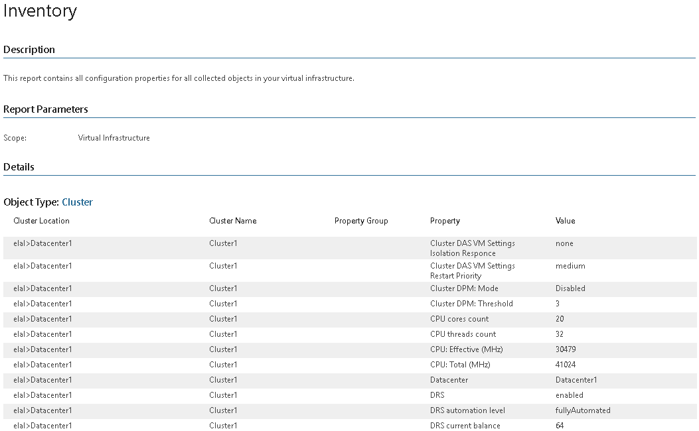

# Inventory

This report provides the most complete and up-to-date configuration information on all objects in your virtual environment.

Report Parameters

You can specify the following report parameter:

* Infrastructure objects: defines a virtual infrastructure level and its sub-components to analyze in the report.

Use Case

This report allows you to document the current configuration of your virtual infrastructure for audit purposes.

