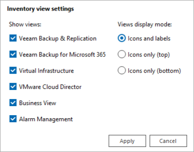
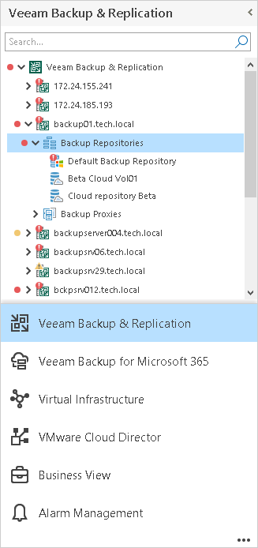
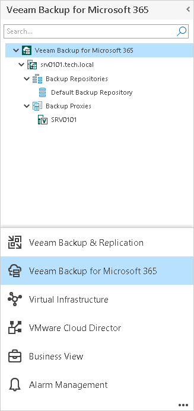
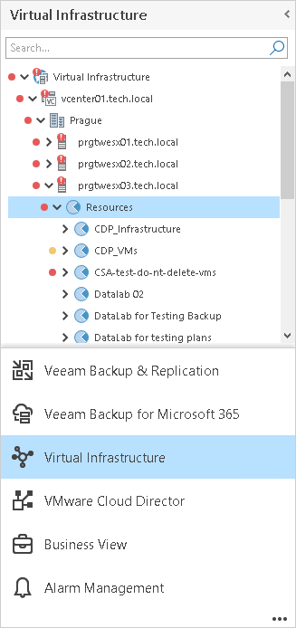
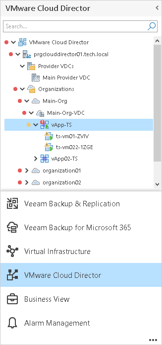
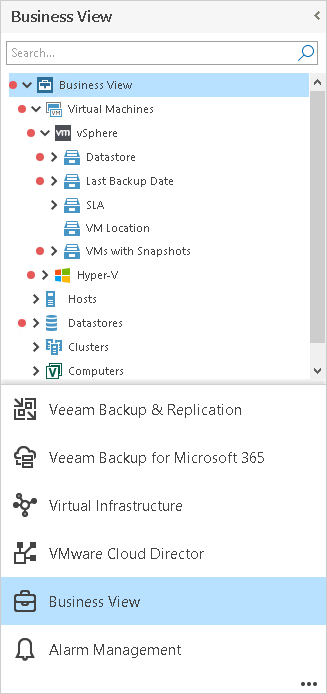
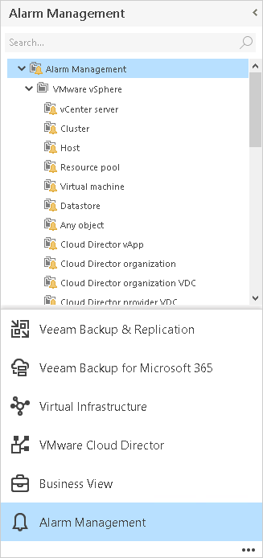

# Inventory Pane

The inventory pane on the left shows a hierarchical list of infrastructure objects. The buttons at the bottom of the inventory pane allow you to switch between Veeam ONE Client views.

Each node in the hierarchy tree reflects the state of a corresponding infrastructure object. If there exist unresolved alarms for the object, Veeam ONE Client displays on the node an icon of an alarm with the highest severity.

Veeam ONE reflects the state of child objects on parent nodes to let you easily find problematic objects. For example, if an error alarm was triggered for a host, the error icon displays on the host node. In addition, a red downward error is shown on the parent cluster node and on the parent management server node to indicate that an error has occurred on the child host. If necessary, you can change Veeam ONE Client settings to display icons next to affected objects only.

* To search for a Veeam Backup & Replication, Veeam Backup for Microsoft 365, virtual infrastructure, VMware Cloud Director or Business View infrastructure component, use the search field at the top of the inventory tree.

Search results depend on the selected view.

* To expand/collapse all tree nodes, right-click the root node in the inventory pane and choose Expand all/Collapse all from the shortcut menu.
* To show all objects with errors and warnings in the hierarchy, right-click the root node in the inventory pane and choose Show all error objects from the shortcut menu.

Veeam ONE Client expands all nodes that have child objects with registered errors or warnings.

* To hide and show the inventory pane, use the collapse/expand arrow at the top right corner of the inventory pane.
* To change the inventory view display settings, click the ellipsis at the bottom right corner of the inventory pane and select the necessary options.

For details on changing display settings, see [Other Settings](other_settings.md).

Veeam Backup & Replication

The Veeam Backup & Replication tree displays a hierarchical list of connected Veeam Backup Enterprise Manager servers, Veeam Backup & Replication servers, and components of the backup infrastructure — backup proxies, backup repositories, WAN Accelerators, tape servers, cloud repositories, and cloud gateways.

Veeam Backup for Microsoft 365

The Veeam Backup for Microsoft 365 tree displays a hierarchical list of connected Veeam Backup for Microsoft 365 servers and components of the backup infrastructure — backup proxies and backup repositories.

Virtual Infrastructure

The Virtual Infrastructure tree displays a hierarchical list of virtual infrastructure objects — vCenter Servers/SCVMM servers, clusters, hosts, folders, VMs, storage objects and so on. It shows the virtual infrastructure in inventory terms, similar to vCenter Server/SCVMM topology presentation.

If you connect a VMware Cloud Director server to Veeam ONE, the Virtual Infrastructure inventory tree displays vCenter Servers attached to VMware Cloud Director and VMware Cloud Director VMs. To hide VMware Cloud Director VMs from the Virtual Infrastructure inventory, enable the Hide VMware Cloud Director VMs from Virtual Infrastructure tree option in Veeam ONE server settings. For details on the VMware Cloud Director display settings, see [Other Settings](other_settings_server.md).

VMware Cloud Director

The VMware Cloud Director tree displays a hierarchical list of VMware Cloud Director objects — provider VDCs, organizations, organization VDCs, vApps, and VMs.

Business View

The Business View tree displays a hierarchical list of categorization groups configured in Business View. It presents the infrastructure topology in business terms and allows you to monitor, alert and report on custom categorization units in your environment.

By default, Veeam ONE Client hides the Uncategorized group for all Business View categories in the inventory tree. To make it available in the Business View hierarchy, disable the Hide ungrouped objects from Business View tree option in Veeam ONE Client server settings. For details on changing Business View display settings, see [Hiding Ungrouped Objects](business_view.md#ungrouped).

Alarm Management

The Alarm Management tree displays the list of available alarm types. Use the Alarm Management view to manage predefined alarms or create new alarms.

