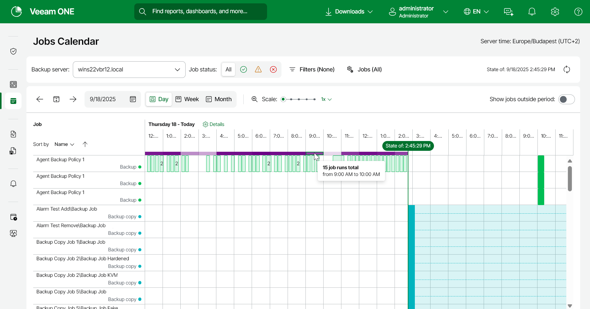
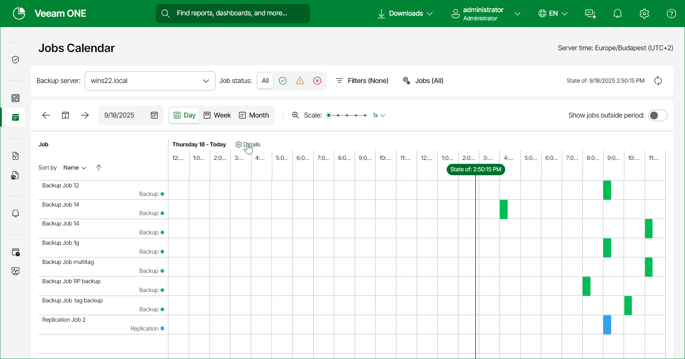
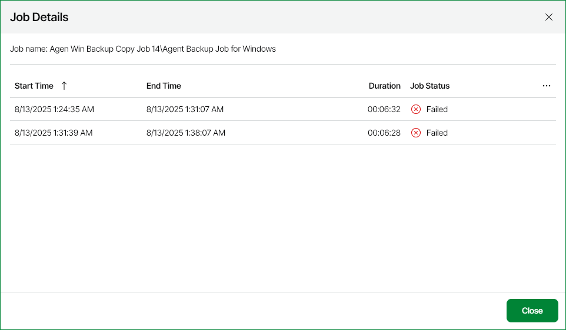

# Jobs Calendar

Jobs Calendar visually represents jobs scheduled for a specified time period. It shows both upcoming and finished job sessions arranged in the calendar format. With the help of Jobs Calendar, you can analyze job history and plan job schedule avoiding previously occurred issues and without the risk of overloading the server.

Limitations

Jobs Calendar does not provide information on the following types of jobs:

* Veeam Backup for AWS jobs
* Veeam Backup for Google Cloud jobs
* Veeam Backup for Microsoft Azure jobs
* CDP policies
* Transaction log backups
* Veeam Backup for Microsoft 365 jobs

Accessing Jobs Calendar

To view Jobs Calendar:

1. Open Veeam ONE Web Client.
2. Open the Jobs Calendar section on the left.
3. From the Backup server drop-down list, select a backup server or Veeam Backup & Replication high availability cluster.

The protection calendar will display data on completed and jobs configured on the selected server.

1. To narrow down the list of jobs:

* Click Filters and select protected workload types and job types that you want to display.
* Click the Job Status icons to narrow the the jobs displayed based on status (Success, Warning, Error).
* Create a custom list of jobs:

1. Click Jobs.
2. Select Manual selection.
3. Select check boxes of the jobs that you want to display.

1. To specify time period:

* Click Day, Week or Month button.
* Click the date link and select the day, week or month that you want to be displayed.

To select the current day, week or month, click the Today button.

Viewing Jobs Calendar

Jobs Calendar marks the monitored job types with the following colors:

* Green — backup job.
* Blue — replication job.
* Aquamarine — backup copy job.
* Beige — tape job.
* Brown — VM and file copy job.
* Dark green — SureBackup.

Jobs Calendar represents completed and scheduled job sessions differently:

* Completed job sessions are transparent.

In the Month view, completed sessions are filled with color.

* Scheduled job sessions are filled with color.

In the Month view, scheduled sessions are transparent.

* Continuous job sessions scheduled for backup window periods are fully colored and connected with dashes.

If a continuous job schedule is split into smaller schedules, the job band will also be split.

To get brief information on a specific job, do one of the following:

* In the Month view, hover the cursor over the job name in the calendar.
* In the Day and Week view, hover the cursor over the job name in the Job column.
* In the Day and Week view, hover the cursor over the colored band of the job.

|  |
| --- |
| Note: |
| For backup copy jobs, the job list will include a separate line for each source job. The job name is presented in the Backup copy job\Source job format.  For backup agent jobs, the job list will include a separate line for each backup agent. The job name is presented in the Backup agent job - backup agent name format. |

The purple band above the calendar indicates how many jobs sessions ran simultaneously during the time period. The more parallel job sessions, the more saturated the band becomes. To see the exact number of job sessions for a specific period, hover the pointer over the purple band. Note that the purple band is available in the Day and Week view only.

By default, jobs are sorted by name. You can change that by selecting the Job types or Earliest job session / Job schedule option in the Sort by drop-down list. Note that sorting is available in the Day and Week view only.

Chained jobs are marked with a chain-like sign. To see information on a job after which a chained job starts, hover the cursor over the chained job color band.

The currently running job sessions are marked with a right-pointing triangle in a circle.

Disabled jobs are marked with horizontal line in a circle.

|  |
| --- |
| Tip: |
| * You can include jobs that do not have any job sessions during the selected period into Jobs Calendar. To do that, switch the Show jobs outside period toggle to On.   Note that the toggle is available in the Day and Week view only.   * If you want to zoom in the time period and all scheduled jobs, use Scale.   Note that the Scale slider is available in the Day and Week view only. |

Viewing Job Details

The protection calendar allows you to view detailed information on all jobs sessions for a specific day. To open day details, do one of the following:

* In the Day view, click Details.
* In the Week view, hover the cursor over the column associated with the necessary day and click Details.

* In the Month view, select the cell associated with the necessary day and click Details.

Each scheduled job session is described with the following set of properties:

* Job — name of a job.
* Job Type — type of job (Backup, Replication, Backup copy, Tape job, VM and file copy, SureBackup).
* Start Time — date and time when the job session will start.
* Average Duration — average time a job session takes to complete. Only the latest 5 sessions are considered.

Each completed job session is described with the following set of properties:

* Job — name of a job.
* Job Type — type of a job (Backup, Replication, Backup copy, Tape job, VM and file copy, SureBackup).
* Job Status — status of the job session (Success, Warning, Failed, Running).
* Start Time — date and time when the job session started.
* End Time — date and time when the job session ended.
* Duration — duration of the job session.
* Average Duration — average time a job session takes to complete. Only the latest 5 sessions are considered.
* Data Transferred, GB — total amount of data transferred during the a job session.

Some colored band segments include data on multiple sessions. Usually, those segments are marked with the number of aggregated sessions. To view the sessions data, click the related segment.

