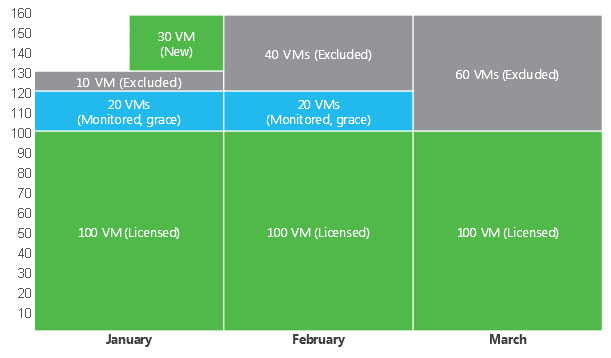

# Exceeding License Limit

In some situations, the number of actually managed objects may exceed the license limit. For example, this may happen when some VMs or hosts are temporarily managed for testing or POC.

For per-instance licenses, Veeam ONE allows you to manage more objects than covered by the number of instances specified in the license. On the first month, the exceeding limit is equal to the number of instances the license covers. For example, if your license covers 500 instances, Veeam ONE allows you to manage objects that consume up to 1000 instances.

Starting from the second month, the exceeding limit varies according to the license type and state of license auto update setting:

Exceeding License Limit

| License Type | Auto Update Enabled\* | Auto Update Disabled |
| Subscription | Up to 20 instances or 20% of the total instance count (whichever number is greater) | Up to 10 instances or 10% of the total instance count (whichever number is greater) |
| Rental | Up to 20 instances or 20% of the total instance count (whichever number is greater) | Up to 20 instances or 20% of the total instance count (whichever number is greater) |

\*and you have successfully submitted license usage report during the last 30 days.

If the license limit is exceeded by no more than the specified percentage or number, Veeam ONE continues to manage all objects.

If the license limit is exceeded by more than the specified percentage or number, all objects exceeding the licensed number and the allowed increase are excluded from monitoring and reporting. To determine what objects to manage, Veeam ONE uses the last-in first-out method (LIFO): objects that were discovered last are removed first from the monitoring and reporting scope.

An increase in the number of managed objects up to the specified percentage is allowed only for a limited period of time. The duration of this grace period is equal to the duration of the license key.

By the end of the grace period, you must update the existing license or decrease the number of managed objects. Otherwise, Veeam ONE will exclude from monitoring and reporting objects that exceed the license limit. VMs are excluded with the help of an automatic exclusion rule that is created by Veeam ONE. You can review VMs covered by this rule in Veeam ONE server settings. For details, see [Choosing VMs and VM Containers to Monitor and Report On](vms_to_monitor.md). If you exceed the number of monitored computers with installed Veeam Agents, file shares and VMs protected on monitored Veeam Backup & Replication servers, Veeam ONE will not exclude any objects from monitoring or reporting. For objects that exceed the license limit, Veeam ONE Web Client will generate Veeam Backup & Replication reports with the Veeam watermark.

In addition to managing objects that exceed the license limit by no more than the specified percentage, Veeam ONE allows you to monitor any number of new objects (that is, objects that are monitored for the first time in the current month). Exceed by new objects is supported for Rental licenses only.

Consider the following example. Veeam ONE uses a Rental license with the license auto update disabled and the expiration date set to 60 days from the license issue date. At the beginning of January the number of VMs is 130, while a license covers 100 VMs. The period for exceeding the license limit is 60 days. Within the first 60 days (in January and February), Veeam ONE will manage 100 + 20 VMs that were discovered first (license limit + 20%). 10 VMs that were discovered last will be excluded from monitoring and reporting. In addition, in the middle of January, Veeam ONE discovers 30 new VMs. Veeam ONE will manage these VMs until the end of the month.

If the license is not updated and the license limit is not increased, Veeam ONE will exclude from monitoring and reporting:

* 30 VMs that exceed the license limit
* 30 VMs that were discovered in January

Exceeding Sockets Limit

For per-socket licenses, Veeam ONE does not offer any grace period. If the number of sockets exceeds the license limit, Veeam ONE will exclude from monitoring and reporting hosts above the license limit.

