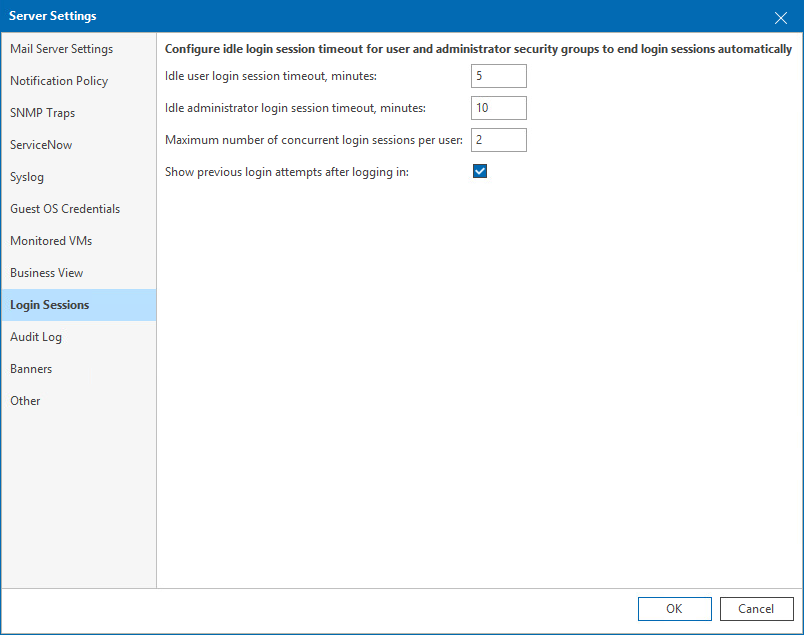

# Login Sessions

On the Login Sessions tab, you can define user session settings and timeouts.

To configure Veeam ONE Client login sessions settings:

1. Open Veeam ONE Client.

For details, see [Accessing Veeam ONE Components](access.md).

1. In the main menu, click Settings > Server Settings.

Alternatively, press [CTRL + S] on the keyboard.

1. In the Server Settings window, open the Login Sessions tab.
2. To limit the duration of an idle session:

* [For users included in the Veeam ONE Power Users and Veeam ONE Read-Only Users security groups] specify the value in the Idle user login session timeout, minutes field.
* [For users included in the Veeam ONE Administrators security group] specify the value in the Idle administrator login session timeout, minutes field.

For details on Veeam ONE security groups, see [Security Groups](security_groups.md).

1. To limit the number of simultaneous login sessions under the same user credentials, specify the value in the Maximum number of concurrent login sessions per user field.

To allow unlimited number of login sessions, specify 0.

1. To display date and time of the last successful or failed authentication to a user, select the Show previous login attempts after logging in check box.

