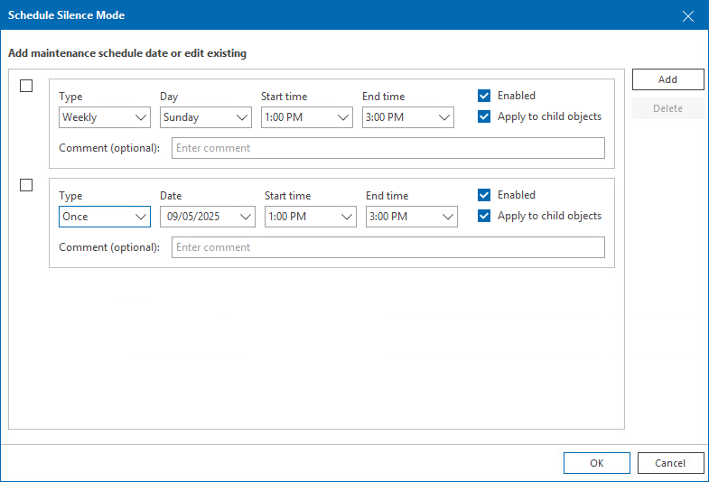

# Silence Mode

Silence mode is an option used to suppress alarms for specific infrastructure objects during planned maintenance operations. After you switch an infrastructure object to the silence mode, Veeam ONE will suppress all alarms on this object.

You can enable the silence mode for single infrastructure objects or containers. When you enable the silence mode for a container, you can choose to propagate alarm suppression to its child objects. For example, if you want to perform maintenance on a host, you can enable the silence mode for the host itself and for all VMs on this host.

You can enable the silence mode manually or set a silence mode schedule.

|  |
| --- |
| Note: |
| Silence mode suppresses both alarms and Veeam Intelligent Diagnostics log analysis when active. For details, see [Veeam Intelligent Diagnostics](intelligent_diagnostics.md). |

Enabling Silence Mode Manually

You can enable the silence mode for an infrastructure object manually. After you switch an infrastructure object to the silence mode manually, Veeam ONE will stop triggering alarms for this object until you manually disable the silence mode.

To enable the silence mode for an infrastructure object manually:

1. Open Veeam ONE Client.

For details, see [Accessing Veeam ONE Components](access.md).

1. At the bottom of the inventory pane, click the necessary view (Veeam Backup & Replication, Veeam Backup for Microsoft 365, Virtual Infrastructure, VMware Cloud Director, Business View).
2. In the inventory pane, right-click an infrastructure object and select Silence Mode from the shortcut menu.

If you select an object container, you can select the scope of objects for which you want to enable the silence mode:

* If you select For this object, the silence mode will be enabled for the selected object only. Alarms on its child objects will not be suppressed.
* If you select For this and all contained objects, the silence mode will be enabled for the container and its child objects.

After you enable the silence mode for an infrastructure object, Veeam ONE will change the infrastructure object icon, and will display the Silence mode label next to the object name in the inventory pane.

Scheduling Silence Mode

You can configure a silence mode schedule for infrastructure objects. When a schedule is set, the silence mode will be enabled and disabled automatically according to the schedule.

To configure a silence mode schedule:

1. Open Veeam ONE Client.

For details, see [Accessing Veeam ONE Components](access.md).

1. At the bottom of the inventory pane, click the necessary view (Veeam Backup & Replication, Veeam Backup for Microsoft 365, Virtual Infrastructure, VMware Cloud Director, Business View).
2. In the inventory pane, right-click an infrastructure object and choose Schedule Silence Mode from the shortcut menu.
3. In the Schedule Silence Mode window, configure the silence mode schedule.

1. Click Add.
2. In the Type field, specify how often the object must be placed into the silence mode (once, monthly, weekly, daily).
3. In the Day/Date field, specify a day when the silence mode must be enabled.
4. In the Start time and End time fields, specify the start and end time of the silence mode period.
5. Select the Apply to child objects check box if you want to enable the silence mode on the object itself and its child objects.
6. In the Comment field, provide additional information about the planned silence mode period. You can enter up to 512 characters in this field.
7. Select the Enabled check box to enable the silence mode schedule.
8. Repeat steps a–g for each schedule entry you want to add.

1. Click OK.

To disable a silence mode schedule:

1. In the Schedule Silence Mode window, clear the Enabled check box next to the necessary schedule entry.
2. Click OK.

The disabled schedule will remain on the list, but it will not be applied to the object.

To delete a schedule:

1. In the Schedule Silence Mode window, select the check box next to the schedule entry you want to remove.
2. Click Delete.
3. Click OK.

Disabling Silence Mode

To exit a scheduled or manual silence mode period:

1. Open Veeam ONE Client.

For details, see [Accessing Veeam ONE Components](access.md).

1. In the inventory pane, right-click an object in the silence mode and select Exit Silence Mode.

After you exit the silence mode, Veeam ONE will resume triggering alarms.

