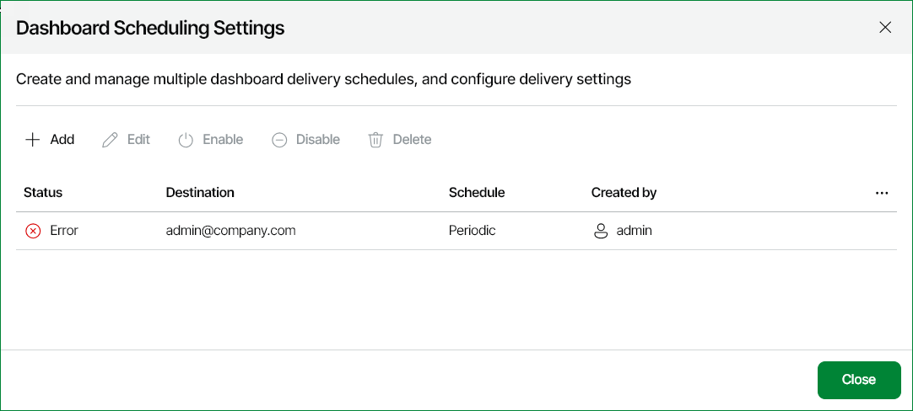

# Managing Dashboard Schedules

You can create multiple schedules for a dashboard. Configuring multiple schedules allows you to set up complex scheduling and delivery method settings for the same dashboard.

To manage dashboard schedules:

1. Open Veeam ONE Web Client.
2. Open the Dashboards section.
3. At the right edge of the dashboard preview image, expand the Settings menu and click Schedule.

Alternatively, you can click the dashboard preview image to open the dashboard and click Schedule at the top left corner of the dashboard window.

1. Use buttons in the Dashboard Scheduling Settings window to manage the schedules that you added for the dashboard:

* To create a new dashboard schedule, click Add.
* To edit scheduling settings, select a schedule in the list and click Edit.
* To enable a previously disabled schedule, select the schedule in the list and click Enable.
* To temporarily disable a schedule, select the schedule in the list and click Disable.
* To delete a schedule from the list, select the schedule in the list and click Delete.

1. To finish working with the schedules, click Close.

