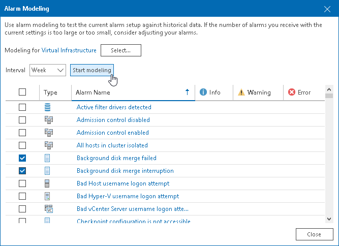

# Modeling Alarm Number

Alarm modeling allows you to forecast the number and type of alarms that will be sent for a specific infrastructure object within a specified time interval. To model the alarm number, Veeam ONE applies the current alarm settings to historical data collected for the selected infrastructure object, and calculates the approximate number of alarms that will be sent within the specified time interval in future.

Alarm modeling can help you avoid receiving non-significant alarms, or conversely missing important events. After you change alarm settings, you can perform alarm modeling to estimate how many alarms will be triggered for an infrastructure object if you keep the effective alarm settings. Taking into consideration the modeled number of alarms, you can consider changing alarm settings. For example, if the number is too high, you can adjust alarm rule conditions.

To forecast the number of alarms that will be sent for a specific infrastructure object:

1. Open Veeam ONE Client.

For details, see [Accessing Veeam ONE Components](access.md).

1. In the main menu, click Modeling.
2. In the Alarm Modeling window, click Select and choose the necessary type of infrastructure objects (Veeam Backup & Replication, Virtual Infrastructure, VMware Cloud Director).
3. In the Select Node window, select check box next to an infrastructure object for which you want to model the number of alarms and click Select.
4. From the Interval drop-down list, select the period for which historical data must be analyzed (week, month or year).
5. In the list of alarms, select check boxes next to alarms for which you want to perform modeling.
6. Click Start Modeling.

Veeam ONE will forecast the number of alarms of different severity that will be sent within the selected period of time.

Other Ways to Perform Alarm Modeling

To perform alarm modeling for a selected infrastructure object:

1. Open Veeam ONE Client.

For details, see [Accessing Veeam ONE Components](access.md).

1. At the bottom of the inventory pane, click the necessary view (Veeam Backup & Replication, Virtual Infrastructure, VMware Cloud Director).
2. In the inventory pane, right-click an infrastructure object and select Alarms > Modeling from the shortcut menu.
3. From the Interval drop-down list, select the period for which historical data must be analyzed (week, month or year).
4. In the list of alarms, select check boxes next to alarms for which you want to perform modeling.
5. Click Start Modeling.

To perform alarm modeling for selected alarms:

1. Open Veeam ONE Client.

For details, see [Accessing Veeam ONE Components](access.md).

1. At the bottom of the inventory pane, click Alarm Management.
2. Select the one or more alarms in the list, right-click the selection and select Modeling from the shortcut menu.
3. At the bottom of the inventory pane, click the necessary view (Veeam Backup & Replication, Virtual Infrastructure, VMware Cloud Director).
4. In the Select Node window, select check box next to an infrastructure object for which you want to model the number of alarms and click Select.
5. From the Interval drop-down list, select the period for which historical data must be analyzed (week, month or year).
6. Click Start Modeling.

