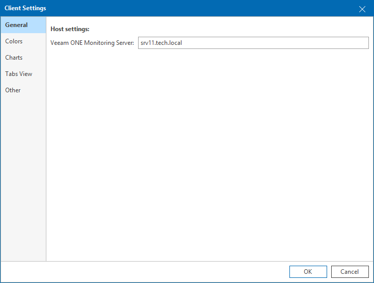

# Step 8. Check Veeam ONE Client Settings

If Veeam ONE Client is installed separately from the Veeam ONE Server component, make sure that Veeam ONE Client can communicate with the Veeam ONE Server part.

On the machine where you installed Veeam ONE Client, start the Veeam ONE Client. If during installation you did not specify the name of a machine where Veeam ONE Server runs, you will be prompted to provide the server name. If, for some reason, you cannot see a window prompting for the Veeam ONE Server name, in Veeam ONE Client main menu select Settings > Client Settings > General, and specify the name of a machine hosting Veeam ONE Server.

