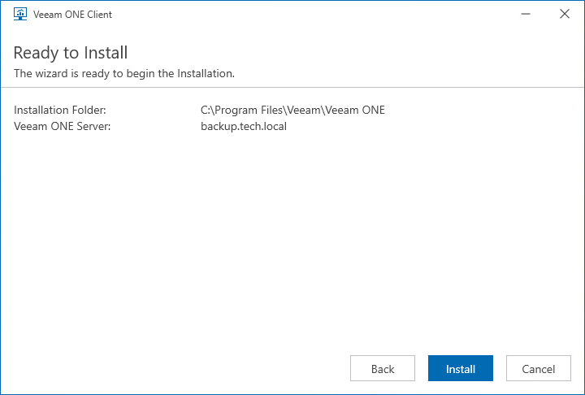

# Step 7. Review Installation Summary

At the Ready to Install step of the wizard, carefully review installation configuration to ensure that you specified correct settings. Click Install to begin the installation process.

When the installation completes, click Finish to close the wizard.

