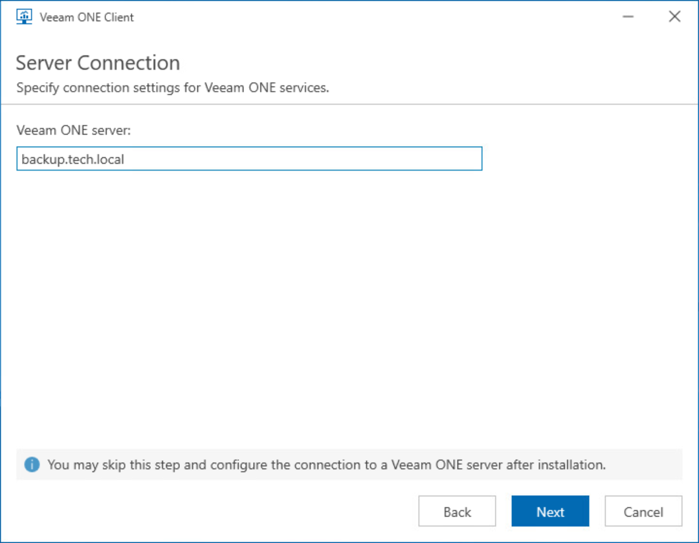

# Step 6. Specify Veeam ONE Server Name

At the Server Connection step of the wizard, specify the FQDN or IP address of a machine where the Veeam ONE Server component is installed.

You can skip this step. In this case, you will be prompted to specify Veeam ONE Server name when you launch Veeam ONE Client for the first time.

