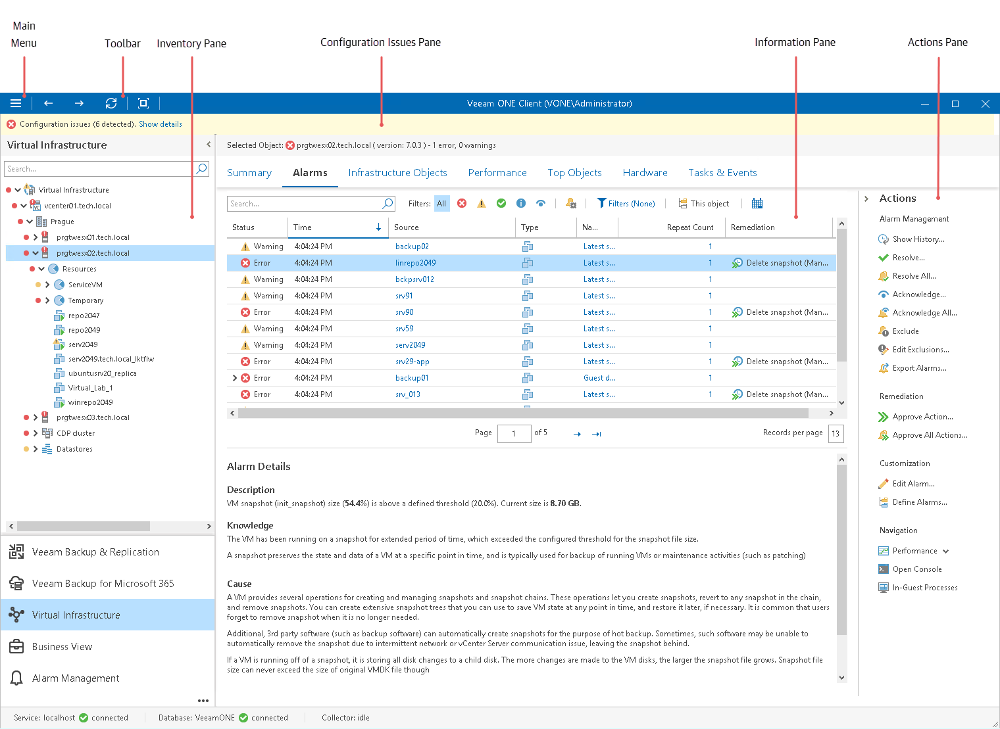

# Navigating Veeam ONE Client

Veeam ONE Client interface includes the following elements:

* [Toolbar and Main Menu](toolbar.md)
* [Inventory Pane](inventory_pane.md)
* [Configuration Issues Pane](configuration_issues_pane.md)
* [Information Pane](information_pane.md)
* [Actions Pane](actions_pane.md)

