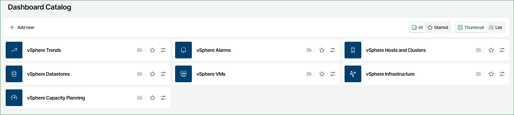
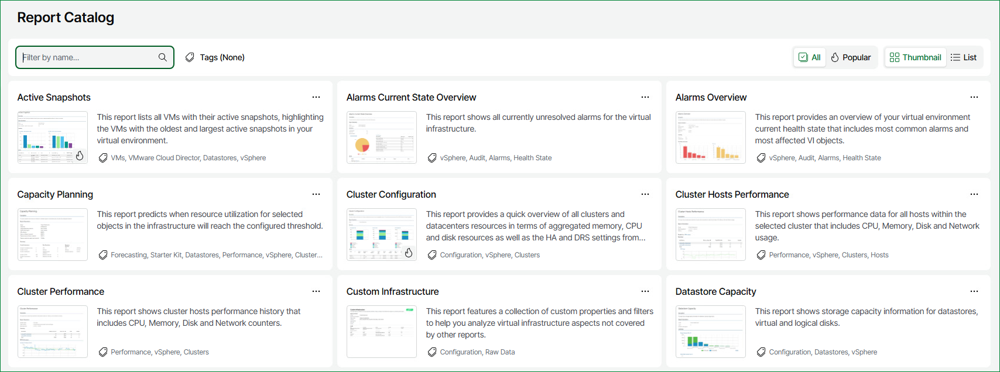
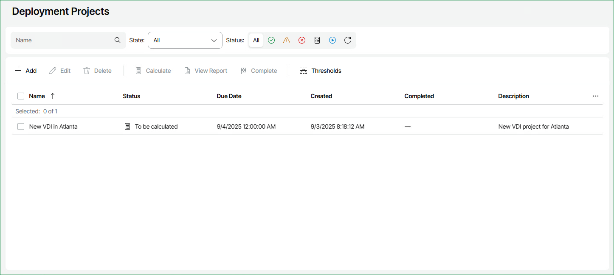
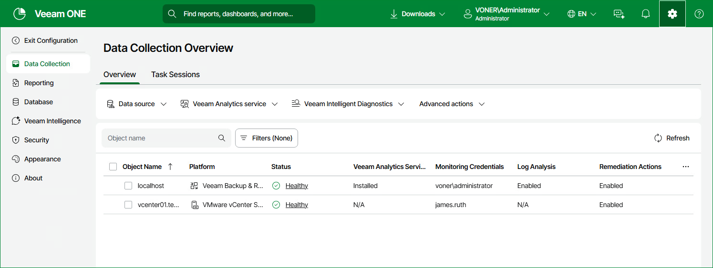

# Navigating Veeam ONE Web Client

Veeam ONE Web Client interface includes the following elements:

* [Veeam Threat Center](data_protection_platform.md)
* [Dashboards](#dashboards)
* [Jobs Calendar](job_calendar.md)
* [Report Catalog](#report_catalog)
* [Saved Reports](#saved_reports)
* [Alarms Overview](reporter_alarms_overview.md)
* Scheduling ([Reports](schedule_reports.md) and [Dashboards](schedule_dashboards.md))
* [Deployment Projects](#deployment_projects)
* Global Search
* [Veeam Intelligence](veeam_intelligence.md)
* Language
* [Downloads](#downloads)
* [Notification bell](#notifications)
* [Configuration](configure_veeam_one.md)

Dashboards

In the Dashboard Catalog section, you can work with predefined and custom dashboards. Veeam ONE dashboards provide at-a-glance view on the state of the Veeam Backup & Replication infrastructure and virtual environment, and present information on the health state, performance, configuration and other aspects of the managed environment.

For details, see [Dashboards](dashboards.md).

Report Catalog

In the Report Catalog section, you can work with predefined and custom reports. Reports provide an insight into performance, health state, configuration and efficiency aspects of the Veeam Backup & Replication infrastructure and virtual environment.

For details, see [Reports](reports.md).

Saved Reports

In the Saved Reports section, you can work with your configured report projects. Saved reports allow you to track future resource utilization and monitor trends and issues in the virtual environment.

Deployment Projects

In the Deployments Projects section, you can work with deployment projects. Deployment projects allow you to predict future resource utilization and plan resource reservations in the virtual environment.

For details, see [Deployment Projects](deployment_projects.md).

Language

The language button allows you to select the display language for Veeam ONE Web Client (English, Japanese, German, French).

Downloads

The Downloads button displays all recent report downloads over the last 24 hours.

For details, see [Reports](reports.md).

Notifications

Veeam ONE Web Client generates notifications about important internal events such as data collection failure, Veeam ONE license expiration and so on.

To view the notifications, at the top right corner, click the button with the bell icon. The drop-down list of notifications will open.

To clear the list of notifications, click Clear All.

By default, new notifications are displayed automatically. To disable this, turn off the Auto-display new message toggle to the left. When a new notification is generated, the number on the notification button increases.

Configuration

In the Configuration section, you can configure Veeam ONE Web Client settings and perform administrative tasks, such as scheduling data collection for reports and dashboards.

For details, see [Configuring Veeam ONE](configure_veeam_one.md).

Page updated 2026-08-07

