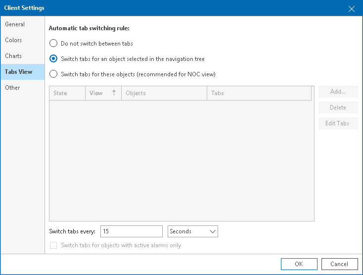
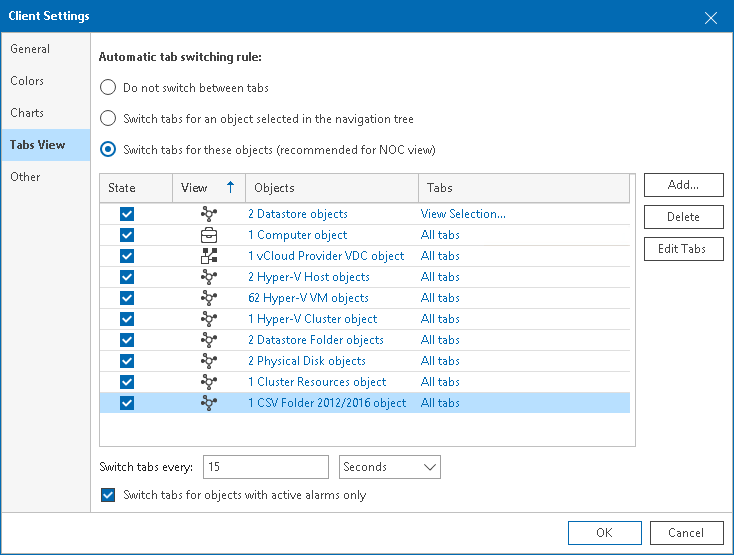

# Tabs View Settings

In the tabs view settings, you can enable the automatic switching between the tabs in Veeam ONE Client.

Automatic switching is intended for screens and monitors in a network operations center (NOC). With this option enabled, Veeam ONE automatically switches between its tabs (dashboards) at a certain time interval, and displays dashboards similarly to a slideshow. An administrator can view the whole picture without interacting with Veeam ONE, and can be sure not to miss critical situations in case they occur.

If automatic switching is enabled, Veeam ONE starts switching tabs only if there is no user input from a keyboard, mouse, and so on. Once the user starts interacting with Veeam ONE Client, Veeam ONE Client stops switching tabs.

Automatic switching is disabled by default. You can enable it and create rules that Veeam ONE will use to switch tabs.

There are two types of rules for the automatic switching of tabs:

* You can choose to switch tabs for an object that is selected in the navigation tree. This rule will be useful if you want to monitor the state of one critical object.
* You can choose to switch specific tabs for a predefined scope of objects. This view will be useful if you want to monitor certain aspects of a critical infrastructure segment.

Switching Tabs for One Infrastructure Object

To enable automatic switching of tabs and create a rule that switches tabs for one infrastructure object:

1. Open Veeam ONE Client.

For details, see [Accessing Veeam ONE Components](access.md).

1. In the inventory pane, click the necessary view — Veeam Backup & Replication, Veeam Backup for Microsoft 365, Virtual Infrastructure, VMware Cloud Director, or Business View.
2. In the inventory pane, select the necessary infrastructure object.
3. In the main menu, click Settings > Client Settings.

Alternatively, press [CTRL + O] on the keyboard.

1. In the Client Settings window, navigate to the Tabs View tab.
2. In the Automatic tab switching rule section, select Switch tabs for an object selected in the navigation tree.
3. In the Switch tabs every <time interval> section, specify a time interval at which tabs must be switched.

You can specify an interval in seconds, minutes, or hours.

1. Click OK.

Switching Tabs for Multiple Infrastructure Objects

To enable automatic switching of tabs and create a rule that switches tabs for specific objects:

1. Open Veeam ONE Client.

For details, see [Accessing Veeam ONE Components](access.md).

1. In the main menu, click Settings > Client Settings.

Alternatively, press [CTRL + O] on the keyboard.

1. In the Client Settings window, navigate to the Tabs View tab.
2. In the Automatic tab switching rule section, select Switch tabs for these objects (recommended for NOC view).
3. Choose objects to include in the scope, and specify tabs that must be displayed.

1. Click Add and choose the type of infrastructure objects to add — Veeam Backup & Replication, Veeam Backup for Microsoft 365, Virtual Infrastructure, VMware Cloud Director, or Business View.
2. In the Select scope window, select check boxes next to objects you want to add to the scope and click OK.

To select an object together with its child objects, click it with the left mouse button.

If you select several objects of different types, Veeam ONE will create a new rule for each object type. For example, if you select a resource pool with VMs, Veeam ONE will add a rule for the resource pool, and a rule for VMs inside it.

1. Select the added object in the list and click Edit Tabs.

Alternatively, you can click the All tabs link next to the added object.

1. In the Select tabs window, select check boxes next to tabs that must be displayed for an object and click OK.
2. Make sure that the State check box is selected for the newly added object. If the check box is cleared, the object will not be added to the scope of automatic tab switching.
3. Repeat steps a–e for all objects that you want to add to the scope.

1. In the Switch tabs every <time interval> section, specify a time interval at which tabs must be switched.

You can specify an interval in seconds, minutes, or hours.

1. Select the Switch tabs for objects with active alarms only check box if Veeam ONE must switch tabs for infrastructure objects that have unresolved alarms — that is, only for objects that have potential problems and that may need your attention.
2. Click OK.

