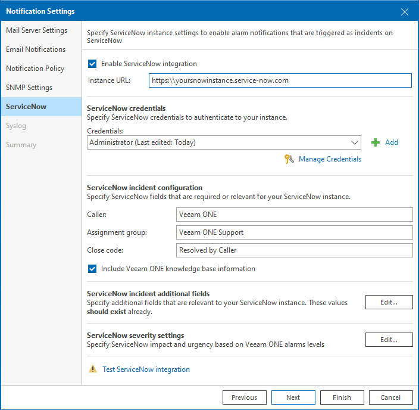

# Step 5. Configure ServiceNow Integration

The ServiceNow integration provides Veeam ONE with enhanced visibility and faster alerts triggered directly as ServiceNow incidents.

At the ServiceNow step of the wizard, specify your ServiceNow settings used for ServiceNow integration.

To specify ServiceNow integration details:

1. Select the Enable ServiceNow integration check box.
2. In the Instance URL field, specify the ServiceNow instance URL, for example https:\\yourinstancename.service-now.com.
3. Specify ServiceNow credentials used to authenticate your ServiceNow instance administration.

For details on permissions required for connection, see [Connection to ServiceNow](connection_to_servicenow.md).

For details on adding credentials records, see [Credentials Manager](credentials_manager.md).

1. [Optional] If your organization policy requires additional ServiceNow credentials, click Add and enter your additional credentials.
2. In the ServiceNow incident configuration section, specify the following details:

* Caller — defines the caller name assigned for the purposes to create, update, and resolve incidents. Veeam ONE is the default value, alternatively you can define a custom name if it already exists on your ServiceNow instance.
* Assignment group — defines the name for the assignment group for the purposes to create, update, and resolve incidents. Veeam ONE Support is the default value, alternatively you can define a custom name if it already exists on your ServiceNow instance.
* Close code — defines the close code for resolved incidents. Use only the close code defined on your ServiceNow instance.
* [Optional] Select the Include Veeam ONE Knowledge Base information check box to mark incidents for knowledge base articles.

1. [Optional] In the ServiceNow incident additional fields section, click Edit and add additional Name and Value parameters to add additional fields relevant to your company's ServiceNow requirements. You must provide both the Name and Value in the same form as found in the ServiceNow REST API.

1. [Optional] In the ServiceNow severity settings section, click Edit and configure the ServiceNow impact and urgency levels that correspond to each Veeam ONE Error, Warning and Information alarm. To test that the severity settings match the correct values in your ServiceNow instance, click Check available values. To return the severity settings to their default values click Back to default values.

1. To test the connection settings, click Test ServiceNow Integration.

Veeam ONE will establish a connection to ServiceNow, create and resolve a test incident.

If you select the Enable ServiceNow integration check box and do not test the connection, Veeam ONE will verify it before saving the notification settings. Additionally, the connection is checked when each Notification Settings item (Mail Server Settings, Email Notifications and so on) changes.

For details on alarm notification settings, see [Configuring Alarm Notifications](configure_alarm_notification.md).

Page updated 2026-08-03

