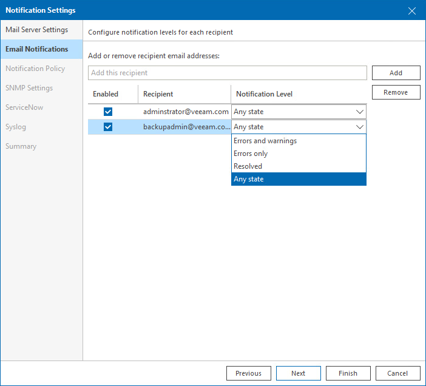

# Step 2. Configure Email Notification Settings

At the Email Notifications step of the wizard, create a list of recipients to include in the default notification group. For every recipient in the group, specify notification conditions.

The default notification group allows you to simplify the process of configuring alarm notification settings. Instead of specifying notification recipients for every alarm, you can create a group of recipients (for example, monitoring operators and administrators) and notify the whole group when an alarm is triggered or when an alarm changes its status.

To add a recipient to the default notification group:

1. In the Add or remove recipient email addresses field, enter an email address of a recipient and click Add.
2. From the Notification Level list, choose the severity of notifications that the recipient will receive:

* Any state — an email notification will be sent every time when an alarm status changes to Error, Warning or Info.
* Errors and warnings — an email notification will be sent every time when an alarm status changes to Error or Warning.
* Errors only — an email notification will be sent every time when an alarm status changes to Error.
* Resolved — an email notification will be sent every time when an alarm status changes to Resolved.

To remove a recipient from the list, select an email address in the list and click Remove.

To temporarily disable notifications for specific recipients, clear check boxes next to necessary email addresses in the list.

|  |
| --- |
| Important! |
| By default, all predefined alarms are configured to notify members of the default notification group in accordance with the specified notification level. After you add recipients to the default notification group, you might need to change alarm settings or adjust the default email notification frequency. For details on alarm settings, see [Specify Alarm Notification Options](alarm_notifications.md). |

