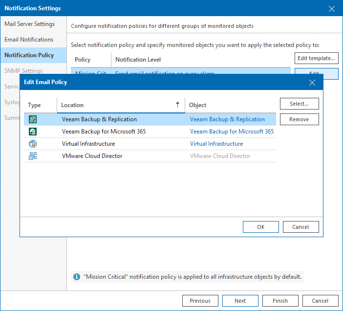
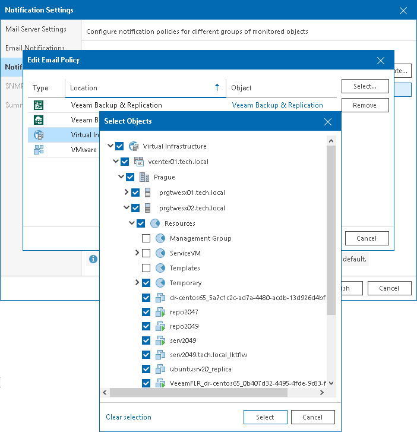

# Step 3. Configure Email Frequency

At the Notification Policy step of the wizard, specify how often Veeam ONE must send email notifications about alarms.

The frequency at which email notifications are sent is defined with the help of notification policies. Veeam ONE offers two notification policies:

* Mission Critical — if this notification policy is used, Veeam ONE creates a new email notification for every alarm. You get an instant email notification once a new alarm is triggered, or once alarm status is changed.
* Other — if this notification policy is used, Veeam ONE sends out an email notification about alarms once in a specific time interval (by default, once in 30 minutes). You do not receive a separate email notification for every alarm. Instead, every 30 minutes you receive one email notification about all alarms that were triggered or that changed their status since the latest notification.

By default, the Mission Critical policy is applied to all objects in your virtual infrastructure, VMware Cloud Director infrastructure and all objects in your backup infrastructure. If necessary, you can apply different notification policy settings to infrastructure objects or Business View groups:

1. Remove effective notification policy settings for chosen infrastructure objects.
2. Apply new notification policy settings to chosen infrastructure objects or Business View groups.

For example, if you want to receive email notifications about problems in the backup environment once within 30 minutes, you must first remove the Mission Critical policy settings for backup infrastructure objects, and then apply the Other policy settings to backup infrastructure objects.

Removing Effective Notification Policy Settings

Before applying new notification policy settings, you must remove the effective settings for the chosen type of infrastructure objects:

1. Select the necessary policy in the list and click Edit.
2. In the Edit Email Policy window, select the necessary type of infrastructure objects and click Remove.

Applying Notification Policy Settings

To apply new notification policy settings to infrastructure objects or Business View groups:

1. Select the necessary policy in the list and click Edit.
2. In the Edit Email Policy window, click Select and choose one of the following options:

* Virtual Infrastructure — browse the virtual infrastructure hierarchy and select check boxes next to objects or infrastructure segments to which the policy settings must apply.
* Business View — browse the Business View hierarchy and select check boxes next to groups or infrastructure objects to which the policy settings must apply.
* VMware Cloud Director — browse the VMware Cloud Director infrastructure and select check boxes next to infrastructure components to which the policy settings must apply.
* Veeam Backup & Replication — browse the backup infrastructure and select check boxes next to infrastructure components to which the policy settings must apply.
* Veeam Backup for Microsoft 365 — browse the Veeam Backup for Microsoft 365 infrastructure and select check boxes next to infrastructure components to which the policy settings must apply.

1. Click Select.
2. [Only for the Other policy] In the Time interval to send summary email (minutes) field, specify how often Veeam ONE must send a summary email informing about triggered alarms.
3. Click OK.

|  |
| --- |
| Tip: |
| You can also change the notification policy settings by adjusting server settings. For details, see [Veeam ONE Server Settings](server_settings.md). |

