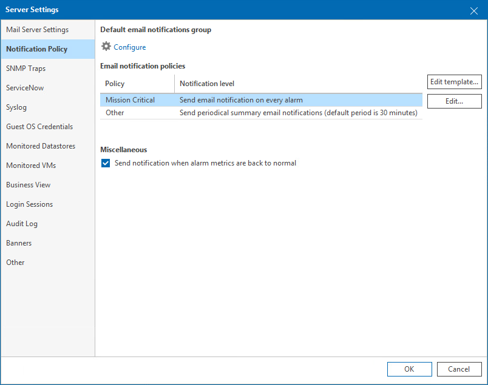

# Notification Policy

In notification policy settings, you can configure the default email notification group, set the necessary notification policies, and specify other notification settings.

To specify notification policy settings:

1. Open Veeam ONE Client.

For details, see [Accessing Veeam ONE Components](access.md).

1. In the main menu, click Settings > Server Settings.

Alternatively, press [CTRL + S] on the keyboard.

1. In the Server Settings window, open the Notification Policy tab.
2. Configure email notifications:

1. In the Default email notification group section, configure a list of recipients who must receive email notifications about Veeam ONE alarms.
2. In the Email notification policies section, specify how often email notifications about Veeam ONE alarms must be sent.
3. In the Miscellaneous section, choose whether you want to send email notifications when conditions that triggered alarms return to normal.

For details on configuring alarm notification options, see [Configuring Email Notifications](email_notifications.md).

