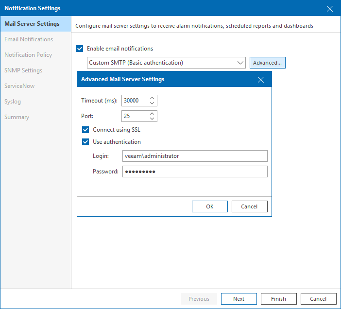
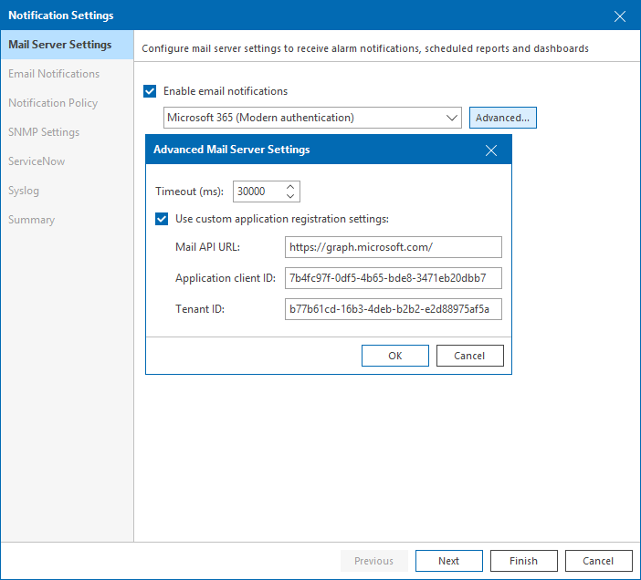
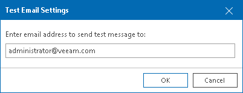

# Step 1. Configure SMTP Server Settings

At the Mail Server Settings tab, configure SMTP server settings or integration with Google Gmail or Microsoft 365. Veeam ONE will use provided settings for notifications generated by both Veeam ONE Monitoring Service and Veeam ONE Reporting Service.

Configuring SMTP Server Settings

To configure SMTP server settings:

1. Select the Enable email notifications check box.
2. From the drop-down list, select Custom SMTP (Basic authentication).
3. In the SMTP server field, enter DNS name or IP address of the SMTP server that will be used to send email notifications. All Veeam ONE email notifications (including test messages), automatically generated reports and dashboards will be sent by this SMTP server.

The default SMTP port is 25.

1. In the From field, enter the email address of the notification sender.

This email address will be displayed in the From field of notifications.

1. To configure additional settings, click Advanced:

1. In the Timeout field, specify server connection timeout in milliseconds.
2. In the Port field, change the default SMTP communication port if required.
3. For SMTP server with SSL support, select Connect using SSL to enable SSL data encryption.
4. If your SMTP server requires authentication, select the Use authentication check box and specify authentication credentials in the Login and Password fields.
5. Click OK.

Configuring Mail Service Integration

To configure mail service integration:

1. Select the Enable email notifications check box.
2. From the drop-down list, select Microsoft 365 or Google Gmail.
3. Click Authorize now.

You will be redirected to your mail service provider page. After you complete the authentication, you will be redirected to Veeam ONE web portal and the mail server settings will be saved automatically.

1. In the From field, enter the email address of the notification sender.

This email address will be displayed in the From field of notifications.

1. To configure additional settings, click Advanced:
2. In the Timeout field, specify server connection timeout in milliseconds.

1. Select the Use custom application registration settings check box and specify Veeam ONE identification parameters in the mail service:

* [For Microsoft 365] Specify Mail API URL, Application client ID and Tenant ID.
* [For Google Gmail] Specify Application client ID and Client secret.

1. Click OK.

Testing Mail Server Settings

You can send out a test email to make sure that mail server settings are configured correctly:

1. Click Send Test Email.
2. Enter an email address at which a test notification should be sent.
3. Click OK.

A test email will be sent to the specified email address.

For details on alarm notification settings, see [Configuring Alarm Notifications](configure_alarm_notification.md).

