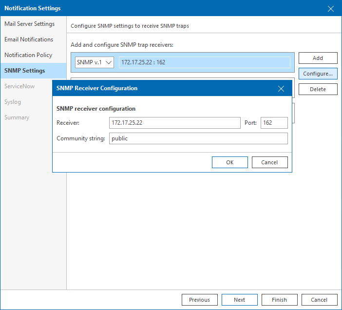
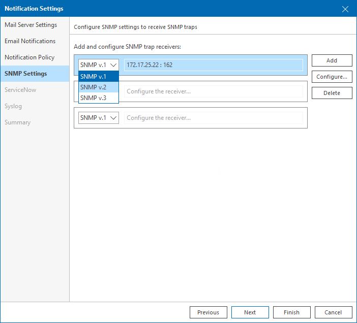

# Step 4. Configure SNMP Settings

At the SNMP Settings step of the wizard, specify trap notification settings that can be used for sending notifications about alarms.

To specify SNMP receiver configuration settings:

1. Click Add.
2. Click Configure to open the SNMP Receiver Configuration window.
3. In the Receiver field, specify DNS name or IP address of the SNMP receiver.
4. In the Port field, specify the port number to be used.

The default SNMP port is 162.

1. In the Community string field, enter the community identifier.
2. Click OK to apply the specified settings.

1. In the list of SNMP receivers, choose the version of the SNMP protocol to be used.

To add a new receiver to the list, click Add and repeat steps 2–7 described above.

Note that after you configure notification settings, you must configure SNMP service properties on the trap recipient computers:

1. Install a standard Microsoft SNMP agent from the Windows distribution.
2. From the Start menu, select Control Panel > Administrative Tools > Services.
3. Double-click SNMP Service to open the SNMP Service Properties window.
4. Click the Traps tab.
5. Add the public string to the Community name list and the host name to the Trap destinations list.
6. Click the Security tab.
7. Make sure the Send authentication trap option is selected.
8. Add the public string to the Accepted community names list.
9. Select the Accept SNMP packets from any hosts option.
10. Click Apply and then OK to accept changes.

|  |
| --- |
| Note: |
| By default, Veeam ONE alarms are not configured to send SNMP traps when the alarm state changes. To enable SNMP traps for an alarm, you should change alarm action settings. For details, see [Enable SNMP Notification for Alarms](enable_snmp_notifications.md). |

