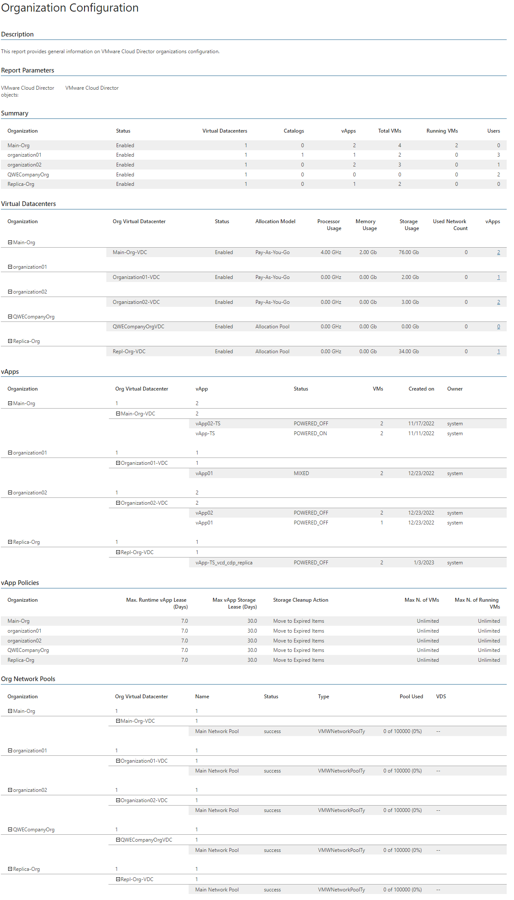

# Organization Configuration

This report documents the current configuration of organizations in your VMware Cloud Director infrastructure.

* The Summary table displays general information on statuses of organizations included in the report scope, the total number of virtual datacenters to which these organizations have access, the total number of catalogs created for the organizations and the total number of vApps in the catalogs.

* The Virtual Datacenters table provides details on resource utilization for each virtual datacenter and shows the total number of deployed vApps.

Click a number in the vApps column to drill down to configuration details for the vApp.

* The vApps table shows vApp properties, such as vApp power status, vApp owner and the number of resident VMs.

* The vApp Policies table displays information on lease policies for compute and storage resources applied to organizations included in the report scope.

* The Org Network Pools table shows network pool properties, such as pool type and the current resource utilization level.

Report Parameters

You can specify the following report parameters:

* VMware Cloud Director objects: defines a list of organizations to analyze in the report.

Use Case

The report helps administrators assess configuration properties of organizations in the monitored VMware Cloud Director infrastructure.

Page updated 2026-08-03

