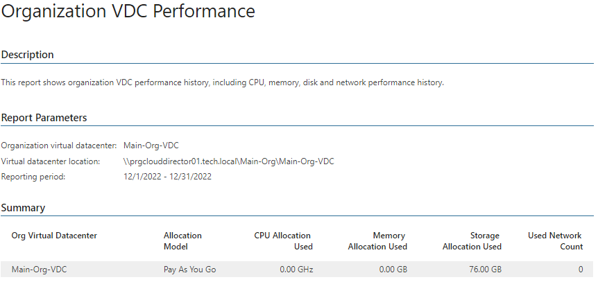
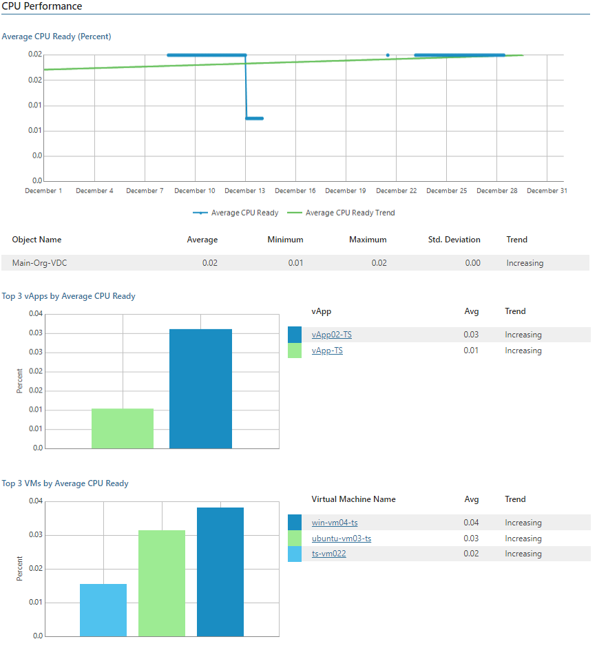

# Organization VDC Performance

This report aggregates historical data and shows performance statistics for a selected organization virtual datacenter across a time range.

* The Summary table provides an overview on organization datacenters, including allocation model, used CPU, memory and storage allocation and used network count.

* The Performance subsections show performance charts with resource usage statistics, list top resource consuming vApps and VMs and resource usage trends for them.

Click a vApp name in the list of top resource consuming vApps to drill down to performance charts with statistics on CPU, memory, disk and network usage for the vApp.

Click a VM name in the list of top resource consuming VMs to drill down to performance charts with statistics on CPU, memory, disk and network usage for the VM.

Report Parameters

You can specify the following report parameters:

* Organization virtual datacenter: defines the organization virtual datacenter to analyze in the report.
* Period: defines the time period to analyze in the report.
* Business hours only: defines time of a day for which historical performance data will be used to calculate the performance trend. All data beyond this interval will be excluded from the baseline used for data analysis.
* Top N: defines the maximum number of vApps and VMs to display in the report output.

Use Case

The report helps you identify organization virtual datacenters with performance issues, right-size resource provisioning and eliminate potential performance bottlenecks.

Page updated 2026-07-31

