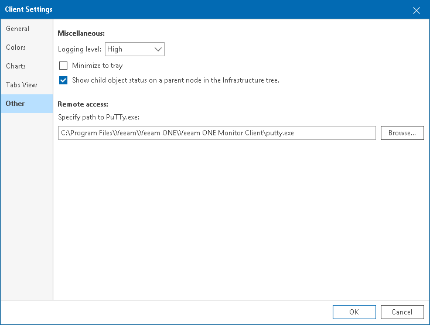

# Other Settings

To specify miscellaneous client settings:

1. Open Veeam ONE Client.

For details, see [Accessing Veeam ONE Components](access.md).

1. In the main menu, click Options > Client Settings.

Alternatively, press [CTRL + O] on the keyboard.

1. In the Client Settings window, navigate to the Other tab.
2. In the Miscellaneous section, specify the following settings:

* From the Logging level list, choose the level of detail for logging:

* High — includes events with the Info, Warning and Error status.
* Low — includes events with the Warning and Error status.
* Off — disables logging.

* Select the Minimize to tray check box if you want to hide Veeam ONE Client to a system tray icon when the Veeam ONE Client window is minimized.
* Clear the Show child object status on a parent node in the Infrastructure tree check box if every object in the inventory tree must reflect its own state only.

If this check box is cleared, the state of child objects with errors and warnings will not be reflected on parent nodes. If this check box is selected, Veeam ONE will show downward arrows on parent nodes to reflect the problematic state of child objects. For details on displaying the infrastructure inventory tree, see [Inventory Pane](inventory_pane.md).

1. In the Remote access section, specify the path to the PuTTy.exe file.

Veeam ONE requires PuTTy to provide easy access to consoles of Linux VMs.

For details on PuTTY, see [PuTTY Documentation Page](http://www.chiark.greenend.org.uk/~sgtatham/putty/docs.html).

For details on accessing VM console for VMware vSphere, see [VMware Remote Console (VMRC)](vsphere_console.md).

For details on accessing VM console for Microsoft Hyper-V, see [Microsoft Hyper-V VM Console](hyperv_console.md).

