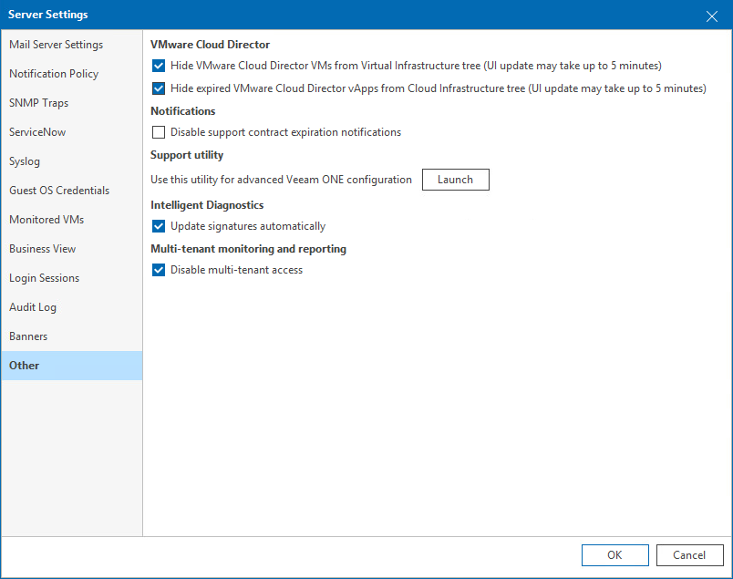

# Other Settings

To specify miscellaneous server settings:

1. Open Veeam ONE Client.

For details, see [Accessing Veeam ONE Components](access.md).

1. In the main menu, click Settings > Server Settings.

Alternatively, you can press [CTRL + S] on the keyboard.

1. In the Server Settings window, open the Other tab.
2. In the VMware Cloud Director section, choose whether VMware Cloud Director VMs must be shown in the Virtual Infrastructure inventory tree:

* If you select the Hide VMware Cloud Director VMs from Virtual Infrastructure tree check box, VMware Cloud Director VMs will be shown in the VMware Cloud Director inventory tree only.
* If you select the Hide expired VMware Cloud Director vApps from Cloud Infrastructure tree check box, expired VMware Cloud Director vApps will not be shown in the VMware Cloud Director inventory tree.

For details on displaying the virtual infrastructure inventory tree, see [Virtual Infrastructure](inventory_pane.md#infrastructure).

1. In the Notifications section, you can disable and enable notification messages about support contract expiration.

If you select the Disable support contract expiration notifications check box, Veeam ONE will not display notification messages in the UI and notification emails.

|  |
| --- |
| Note: |
| This option does not disable internal alarms notifying about support expiration. It only controls whether notification messages must be displayed in the UI and notification emails. For details on working with internal alarms, see [Working with Internal Alarms](internal_alarms.md). |

1. In the Support utility section, click Launch, to run the Veeam ONE Settings Utility.

The utility allows you to change configuration settings of the Veeam ONE software components. For details on working with Veeam ONE Settings Utility, see [Veeam ONE Settings Utility](appendix.md).

|  |
| --- |
| Important! |
| The Veeam ONE Settings utility must be used only under the guidance of Veeam Support. It is strongly recommended that you obtain detailed instructions from the Veeam Support team before changing any configuration settings in your Veeam ONE deployment. |

1. In the Intelligent Diagnostics section, you can disable and enable automatic update of Veeam Intelligent Diagnostics signatures:

If you fill the Update signatures automatically check box, Veeam ONE will connect to the Veeam Technical Support web server and update signatures once a day. For details on working with signatures, see [Managing Signatures](manage_support_signatures.md).

1. In the Multi-tenant monitoring and reporting section, fill the Disable multi-tenant access check box to restrict access to Veeam ONE Client and Veeam ONE Web Client for users who have permissions on monitored infrastructure, but not included in Veeam ONE security groups. For details on multi-user access, see [Multi-Tenant Monitoring and Reporting](multitenant.md).

