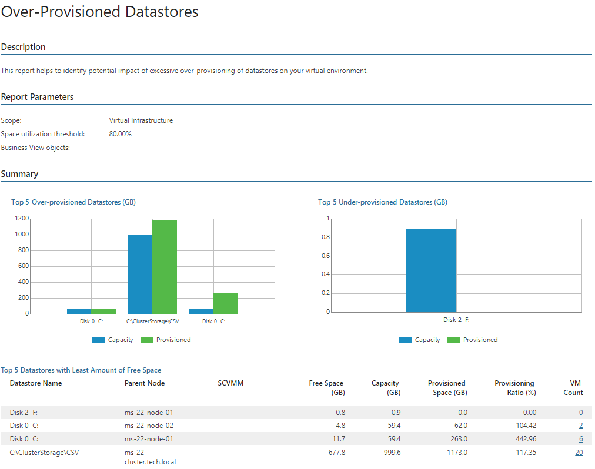

# Over-Provisioned Datastores (Hyper-V)

Dynamic disk technology allows administrators to dedicate more storage space to VMs than there is real physical capacity. This report helps you assess the potential impact of excessive over-provisioning of disks on your virtual environment.

* The Summary section includes the following elements:

+ The Top 5 Over-provisioned Datastores chart shows 5 disks whose amount of provisioned storage space exceeds the total capacity.
+ The Top 5 Under-provisioned Datastores chart shows 5 disks whose amount of provisioned storage space is way below the total capacity.
+ The Top 5 Datastores with Least Amount of Free Space table displays top 5 disks that will run out of free space sooner than other disks.

* The Details tables provide information on storage space utilization and the number of days left before the specified space utilization/free space threshold will be breached. Arrows in the Out of Free Space in … (Days) column show whether the amount of free space on the disk has increased (green arrow), decreased (red arrow) or stayed the same (grey arrow) over the previous week.

Click a number in the VM Count column of the Top 5 Datastores with Least Amount of Free Space table or of the details table to get the list of VMs that store data on the disk and to discover how much space is provisioned for these VMs.

Click a number in the Out of Free Space in … (Days) column of the details table to drill down to details and recommendations for the disk.

|  |
| --- |
| Note: |
| The Provisioned Space (GB) column shows the size of all datastore files, including files that are not associated with any VM.  If you want to see the size of files associated with VMs that store data on disk, click a number in the VM Count column. |

Report Parameters

You can specify the following report parameters:

* Infrastructure objects: defines a virtual infrastructure level and its sub-components to analyze in the report.
* Business View objects: defines Business View groups to analyze in the report. The parameter options are limited to objects of the Storage type.

Business View groups from the same category are joined using Boolean OR operator, Business View groups from different categories are joined using Boolean AND operator. That is, if you select groups from the same category, the report will contain all objects that are included in groups. However, if you select groups from different categories, the report will contain only objects that are included in all selected groups.

* Space utilization threshold: defines the threshold for the amount of space in use on the disks.
* Minimum free space threshold: defines the threshold for the amount of free space left on the disks.

Use Case

The report analyzes disk space utilization trend and calculates the number of days left before storage utilization will breach the specified threshold.

