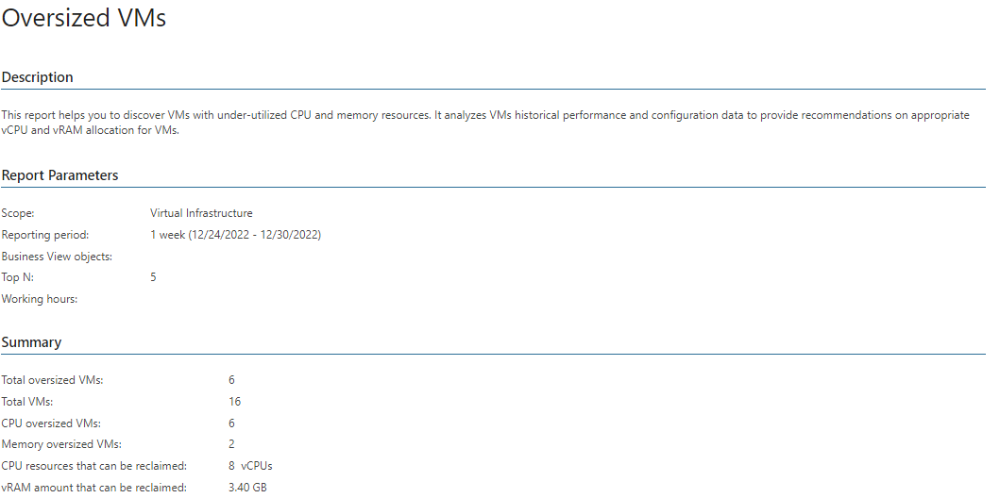
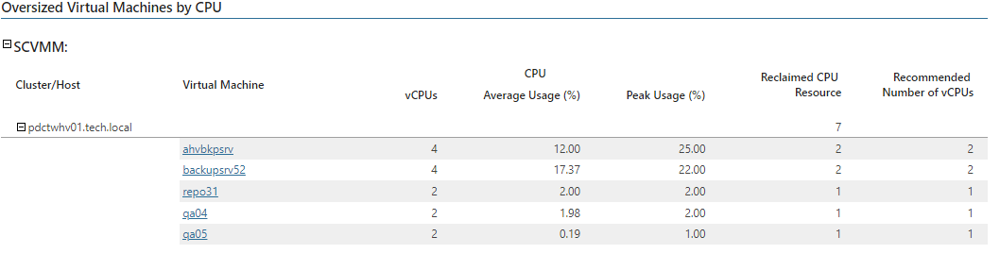
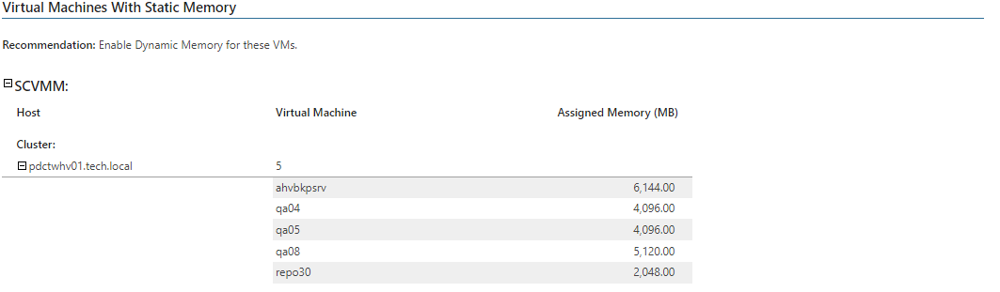

# Oversized VMs (Hyper-V)

This report allows you to identify VMs that have more allocated resources such as vRAM or vCPU than they require.

* The Summary section provides an overview of the current state of your infrastructure, including the total number of VMs and the number of CPU and memory oversized VMs, and shows recommendations on resource allocation.

* The Oversized Virtual Machines by CPU and Oversized Virtual Machines by Memory tables display VMs with excessive CPU and memory resources and deliver recommendations for their reconfiguration.

Click a VM name in the Virtual Machine column to drill down to VM performance charts that show how CPU and memory usage has been changing within the reporting period.

* The Virtual Machines with Static Memory table lists all discovered VMs with static memory, their location and the amount of provisioned memory resources. You can use this information to consider enabling dynamic memory for these VMs.

Report Parameters

You can specify the following report parameters:

* Infrastructure objects: defines a virtual infrastructure level and its sub-components to analyze in the report.
* Business View objects: defines Business View groups to analyze in the report. The parameter options are limited to objects of the Virtual Machine type.

Business View groups from the same category are joined using Boolean OR operator, Business View groups from different categories are joined using Boolean AND operator. That is, if you select groups from the same category, the report will contain all objects that are included in groups. However, if you select groups from different categories, the report will contain only objects that are included in all selected groups.

* Period: defines the time period to analyze in the report. Note that the reporting period must include at least one successfully completed Object properties data collection task for the selected scope. Otherwise, the report will contain no data.
* Business hours only: defines time of a day for which historical performance data will be used to calculate the performance trend. All data beyond this interval will be excluded from the baseline used for data analysis.
* Top N: defines the maximum number of VMs the report will analyze.

Use Case

By analyzing historical performance, this report helps you identify VMs with excessive resource provisioning. You can use data in this report to change the current VM configuration and relocate VMs to other hosts.

Page updated 2026-07-31

