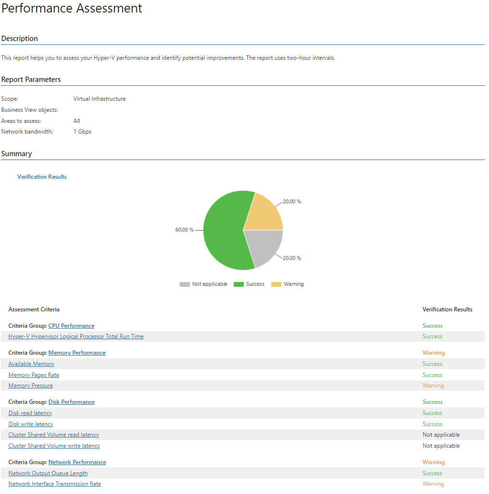

# Performance Assessment

This report evaluates whether the Microsoft Hyper-V infrastructure is configured optimally, helps find potential issues and suggests actions aimed at boosting its efficiency. The report analyzes data over the past 2 weeks and checks whether performance thresholds are exceeded or the number of times Veeam ONE Client triggered Error and Warning alarms. Performance thresholds are defined in alarm counters in Veeam ONE Client. If a threshold is exceeded, the report will deliver Warning or Error verification result depending on counter settings.

* The Summary section includes the following elements:

* The Verification Result chart displays the share of failed and passed verification tests, test that are not applicable, and tests that completed with warnings.
* The Assessment Criteria table lists criteria used in the report to evaluate Hyper-V infrastructure performance, and shows the assessment results.

* The Performance tables show detailed assessment result for each criterion and provides recommendations on how to improve infrastructure performance.

The report takes into account the following criteria when analyzing performance parameters:

CPU Performance

CPU Performance

| Criterion | Description |
| CPU Runtime | The criterion thresholds are specified in the Total run time counter settings of the Host CPU Usage alarm. |

Memory Performance

Memory Performance

| Criterion | Description |
| Available Memory | The criterion thresholds are specified in the Hyper-V Services Memory Usage counter settings of the Host Available Memory alarm. |
| Memory Pages Rate | The criterion thresholds are specified in the Pages/sec counter settings of the Host Memory Pages Usage alarm.  For more information about memory page rate counters, see [Microsoft TechNet article](https://technet.microsoft.com/en-us/library/cc958290.aspx). |
| Host Memory Pressure | The criterion thresholds are specified in the Average Pressure counter settings of the Host Average Memory Pressure alarm. |

Disk Performance

Disk Performance

| Criterion | Description |
| Disk read Latency | The criterion thresholds are specified in the Disk/Physical Disk: Avg Disk sec/Read counter settings of the Datastore read latency alarm. |
| Disk write Latency | The criterion thresholds are specified in the Disk/Physical Disk: Avg Disk sec/Write counter settings of the Datastore write latency alarm. |
| Cluster Shared Volume read latency | The criterion thresholds are specified in the Disk/CSV: Read Latency counter settings of the Cluster shared volume read latency alarm. |
| Cluster Shared Volume write latency | The criterion thresholds are specified in the Disk/CSV: Write Latency counter settings of the Cluster shared volume write latency alarm |

Network Performance

Network Performance

| Criterion | Description |
| Network Output Queue Length | The criterion thresholds are specified in the Network Output Queue Length counter of the Host network average output queue length alarm. |
| Network Interface Transmission Rate | The criterion threshold is calculated the following way: Network Bytes Total/sec counter value divided by the Network Bandwidth value specified in the report parameters. |

Report Parameters

You can specify the following report parameters:

* Infrastructure objects: defines a virtual infrastructure level and its sub-components to analyze in the report.
* Business View objects: defines Business View groups to analyze in the report. The parameter options are limited to objects of the Host type.

Business View groups from the same category are joined using Boolean OR operator, Business View groups from different categories are joined using Boolean AND operator. That is, if you select groups from the same category, the report will contain all objects that are included in groups. However, if you select groups from different categories, the report will contain only objects that are included in all selected groups.

* Network bandwidth: defines network bandwidth to analyze in the report.
* Areas to assess: defines a type of resources to analyze in the report (All, CPU, Memory, Disk, Network).

Use Case

The report analyzes performance of the Microsoft Hyper-V infrastructure and provides recommendations to improve its configuration. You can use report results to implement the necessary hardware and software optimizations.

