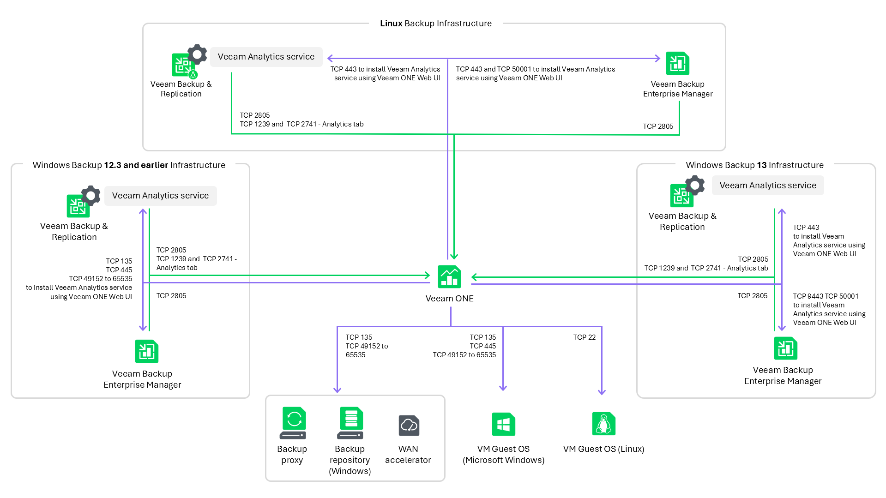

# Ports

The following table lists connection settings required for proper communication between Veeam ONE components, virtualization servers, VMware Cloud Director servers, Veeam Backup & Replication servers and Veeam Backup for Microsoft 365 servers.

Communication with Virtualization Servers

Communication with Virtualization Servers

| From | To | Protocol | Port | Notes |
| Veeam ONE | ESXi server | TCP | 443 | Required to collect data from the ESXi server over HTTPS. Note that you must open this port manually.  To learn how to check the current state of the vSphere API port, see the VMware vSphere documentation. |
| TCP | 5989 | Required to collect ESXi host hardware details via CIM XML. |
| vCenter Server | TCP | 443 | Required to collect data from vCenter Server over HTTPS.  To learn how to check the current state of the vSphere API port, see the VMware vSphere documentation. |
| TCP | 10080 | Default port used to access the vCenter Inventory Service and collect vCenter Server tags. |
| Platform Services Controller (PSC) | TCP | 443 | Default port used to access vCenter Server PSCs over HTTPS to collect and assign VMware Tags data.  Required for vCenter Server starting from version 6.5. |
| VMware Cloud Director | TCP | 443 | Required to collect data from vCloud Director REST API. Note that you must open this port manually.  For more information about vCloud Director API, see [VMware documentation](https://docs.vmware.com/en/VMware-Cloud-Director/index.html). |
| SCVMM | TCP | 8100 | Default port used to communicate with the VMM server through WCF. Required by the Veeam ONE Service. |
| Hyper-V server | TCP | 135 | Required to gather CPU and memory performance data from the Microsoft Hyper-V server through WMI.  Port 445 is also required to access remote registry.  For more information about enabling and disabling WMI traffic, see [Connecting to WMI Remotely with VBScript](http://msdn.microsoft.com/en-us/library/aa389286%28v%3Dvs.85%29.aspx) and [Setting up a Remote WMI Connection](http://msdn.microsoft.com/en-us/library/aa822854%28v%3Dvs.85%29.aspx).  Note that to gather performance data from Windows Server 2012 and 2012 R2, you must additionally enable network discovery. |
| TCP | 49152 to 65535 | Dynamic RPC port range for Microsoft Windows 2008 and later. For more information, see [this Microsoft KB article](https://support.microsoft.com/kb/929851/en-us).  Note: If you use default Microsoft Windows firewall settings, you do not need to configure dynamic RPC ports. During setup, Veeam ONE automatically creates a firewall rule for the runtime process. If you use firewall settings other than default ones or application-aware processing fails with the "RPC function call failed" error, you need to configure dynamic RPC ports. For more information on how to configure RPC dynamic port allocation to work with firewalls, see [this Microsoft KB article](https://support.microsoft.com/en-us/help/154596/how-to-configure-rpc-dynamic-port-allocation-to-work-with-firewalls). |

Communication with Backup Infrastructure Components

The following diagram illustrates the key ports connections configured between the Veeam Backup & Replication server and Veeam ONE:

Communication with Backup Infrastructure Components

| From | To | Protocol | Port | Notes |
| Veeam ONE | Veeam Backup & Replication server (Windows) version 12.3 and earlier | Note: all of these ports below for Veeam Backup & Replication server (Windows) are required to install Veeam Analytics service using Veeam ONE Web Client. | | |
| TCP | 135 | Required to collect data through WMI and install Veeam Analytics service using Veeam ONE Web Client.  Port 445 is also required to access remote registry.  For more information about enabling and disabling WMI traffic, see [Connecting to WMI Remotely with VBScript](http://msdn.microsoft.com/en-us/library/aa389286%28v%3Dvs.85%29.aspx) and [Setting up a Remote WMI Connection](http://msdn.microsoft.com/en-us/library/aa822854%28v%3Dvs.85%29.aspx). |
| TCP | 49152 to 65535 | Dynamic RPC port range for Microsoft Windows 2008 and later. For more information, see [this Microsoft KB article](https://support.microsoft.com/kb/929851/en-us).  Note: If you use default Microsoft Windows firewall settings, you do not need to configure dynamic RPC ports. During setup, Veeam ONE automatically creates a firewall rule for the runtime process. If you use firewall settings other than default ones or application-aware processing fails with the "RPC function call failed" error, you need to configure dynamic RPC ports. For more information on how to configure RPC dynamic port allocation to work with firewalls, see [this Microsoft KB article](https://support.microsoft.com/en-us/help/154596/how-to-configure-rpc-dynamic-port-allocation-to-work-with-firewalls). |
| Veeam Backup & Replication server (Windows) version 13.0.1 and newer | TCP | 443 | Required to install Veeam Analytics Service using Veeam ONE Web Client. |
| Veeam Backup & Replication server (Linux) | TCP | 443 | Required to install Veeam Analytics Service using Veeam ONE Web Client. |
| Veeam Backup Enterprise Manager (Windows) version 12.3 and earlier | Note: all of these ports below for Veeam Backup Enterprise Manager (Windows) are required to install Veeam Analytics service using Veeam ONE Web Client. | | |
| TCP | 135 445 | Required to collect data through WMI and install Veeam Analytics service using Veeam ONE Web Client.  Port 445 is required to access remote registry.  For more information about enabling and disabling WMI traffic, see [Connecting to WMI Remotely with VBScript](http://msdn.microsoft.com/en-us/library/aa389286%28v%3Dvs.85%29.aspx) and [Setting up a Remote WMI Connection](http://msdn.microsoft.com/en-us/library/aa822854%28v%3Dvs.85%29.aspx). |
| TCP | 49152 to 65535 | Dynamic RPC port range for Microsoft Windows 2008 and later. For more information, see [this Microsoft KB article](https://support.microsoft.com/kb/929851/en-us).  Note: If you use default Microsoft Windows firewall settings, you do not need to configure dynamic RPC ports. During setup, Veeam ONE automatically creates a firewall rule for the runtime process. If you use firewall settings other than default ones or application-aware processing fails with the "RPC function call failed" error, you need to configure dynamic RPC ports. For more information on how to configure RPC dynamic port allocation to work with firewalls, see [this Microsoft KB article](https://support.microsoft.com/en-us/help/154596/how-to-configure-rpc-dynamic-port-allocation-to-work-with-firewalls). |
| Veeam Backup Enterprise Manager (Windows) version 13.0.1 and newer | TCP | 9443 50001 | Required to install remote Veeam Analytics service using Veeam ONE Web Client. |
| Veeam Backup Enterprise Manager (Linux) | TCP | 443 50001 | Required to install remote Veeam Analytics service using Veeam ONE Web Client. |
| Backup proxy, Backup repository, WAN accelerator (Windows) | TCP | 135 | Required to gather CPU and memory performance data from the backup proxy through WMI.  For more information about enabling and disabling WMI traffic, see [Connecting to WMI Remotely with VBScript](http://msdn.microsoft.com/en-us/library/aa389286%28v%3Dvs.85%29.aspx) and [Setting up a Remote WMI Connection](http://msdn.microsoft.com/en-us/library/aa822854%28v%3Dvs.85%29.aspx).  Note that to gather performance data from Windows Server 2012 and 2012 R2, you must additionally enable network discovery. |
| TCP | 49152 to 65535 | Dynamic RPC port range for Microsoft Windows 2008 and later. For more information, see [this Microsoft KB article](https://support.microsoft.com/kb/929851/en-us).  Note: If you use default Microsoft Windows firewall settings, you do not need to configure dynamic RPC ports. During setup, Veeam ONE automatically creates a firewall rule for the runtime process. If you use firewall settings other than default ones or application-aware processing fails with the "RPC function call failed" error, you need to configure dynamic RPC ports. For more information on how to configure RPC dynamic port allocation to work with firewalls, see [this Microsoft KB article](https://support.microsoft.com/en-us/help/154596/how-to-configure-rpc-dynamic-port-allocation-to-work-with-firewalls). |
| VM Guest OS (Microsoft Windows) | TCP | 135 445 | Required to monitor Microsoft Windows VM guest OS processes and services through WMI.  For more information about enabling and disabling WMI traffic, see [Connecting to WMI Remotely with VBScript](http://msdn.microsoft.com/en-us/library/aa389286%28v%3Dvs.85%29.aspx) and [Setting up a Remote WMI Connection](http://msdn.microsoft.com/en-us/library/aa822854%28v%3Dvs.85%29.aspx). |
| TCP | 49152 to 65535 | Dynamic RPC port range for Microsoft Windows 2008 and later. For more information, see [this Microsoft KB article](https://support.microsoft.com/kb/929851/en-us).  Note: If you use default Microsoft Windows firewall settings, you do not need to configure dynamic RPC ports. During setup, Veeam ONE automatically creates a firewall rule for the runtime process. If you use firewall settings other than default ones or application-aware processing fails with the "RPC function call failed" error, you need to configure dynamic RPC ports. For more information on how to configure RPC dynamic port allocation to work with firewalls, see [this Microsoft KB article](https://support.microsoft.com/en-us/help/154596/how-to-configure-rpc-dynamic-port-allocation-to-work-with-firewalls). |
| VM Guest OS (Linux) | TCP | 22 | Required to monitor Linux VM guest OS processes and services through SSH. |
| Veeam Backup & Replication server / Veeam Backup Enterprise Manager | Veeam ONE Server | TCP | 2805 (by default) | Required for communication between remote Veeam Analytics Service and Veeam ONE Monitoring service. This is required for data collection. |
| Veeam Backup & Replication server | Veeam ONE Server | TCP | 1239 2741 | Required to use the Analytics tab in the Veeam Backup & Replication. If the backup console is deployed on a separate VM, these ports must also be opened on that machine. |

Communication with Veeam Backup for Microsoft 365

Communication with Veeam Backup for Microsoft 365

| From | To | Protocol | Port | Notes |
| Veeam ONE | Veeam Backup for Microsoft 365 | TCP | 135 445 | Required to gather CPU and memory performance data from Veeam Backup for Microsoft 365 through WMI.  For more information about enabling and disabling WMI traffic, see [Connecting to WMI Remotely with VBScript](http://msdn.microsoft.com/en-us/library/aa389286%28v%3Dvs.85%29.aspx) and [Setting up a Remote WMI Connection](http://msdn.microsoft.com/en-us/library/aa822854%28v%3Dvs.85%29.aspx). |
| TCP | 49152 to 65535 | Dynamic RPC port range for Microsoft Windows 2008 and later. For more information, see [this Microsoft KB article](https://support.microsoft.com/kb/929851/en-us).  Note: If you use default Microsoft Windows firewall settings, you do not need to configure dynamic RPC ports. During setup, Veeam ONE automatically creates a firewall rule for the runtime process. If you use firewall settings other than default ones or application-aware processing fails with the "RPC function call failed" error, you need to configure dynamic RPC ports. For more information on how to configure RPC dynamic port allocation to work with firewalls, see [this Microsoft KB article](https://support.microsoft.com/en-us/help/154596/how-to-configure-rpc-dynamic-port-allocation-to-work-with-firewalls). |
| TCP | 4443 | Required to collect data from Veeam Backup for Microsoft 365 REST API over HTTPS. |
| TCP | 5985 5986 | Required to remotely enable the Veeam Backup for Microsoft 365 REST API service when adding a server to Veeam ONE and also for installing certificates for federated authentication.  Port 5986 is used for communication over HTTPS. |

Other Communications

Other Communications

| From | To | Protocol | Port | Notes |
| Veeam ONE | Veeam License Update Server | TCP | 443 | Default port used to access Veeam License Update Server over HTTPS to automatically update license and Veeam Intelligent Diagnostics signatures.  Veeam License Update Server endpoints:   * one.butler.veeam.com |
| TCP | 80 | Required for certificate validation when Veeam ONE connects to Veeam License Update Server to check if the new license is available and download it.  Certificate verification endpoints:   * \*.ss2.us * \*.amazontrust.com   Consider that certificate verification endpoints (CRL URLs and OCSP servers) are subject to change. The actual list of addresses can be found in the certificate itself. |
| SMTP server | TCP | 25 | Default port used by the SMTP server to send email notifications.  The actual port number depends on the configuration of your environment. |
| File Server (SMB) | TCP | 445 | Port required to get information about used and free space on SMB shares used by connected Microsoft Hyper-V hosts and clusters. |
| Veeam Intelligence | TCP | 443 | Port required to connect Veeam ONE Server to Veeam CDN Connection  Veeam Intelligence endpoints:   * cdn.rest-ai.veeam.com * js.veeam.com |
| TCP | 443 | Port required to connect Veeam ONE Server and workstation to AI service  Veeam Intelligence endpoints:   * rest-ai.veeam.com |
| Veeam ONE Server | Microsoft SQL Server | TCP | 1433 | Port used for communication with the Microsoft SQL Server on which the Veeam ONE database is deployed. Additional ports may need to be open depending on your configuration. For details, see [Microsoft Docs](https://msdn.microsoft.com/en-us/library/cc646023%28v%3Dsql.120%29.aspx#BKMK_ssde). |
| PostgreSQL | TCP | 5432 | Used by Veeam ONE Web Client to communicate with the PostgreSQL database. Additional ports may need to be open depending on your configuration. For details, see [Microsoft Docs](https://msdn.microsoft.com/en-us/library/cc646023%28v%3Dsql.120%29.aspx#BKMK_ssde). |
| Veeam ONE Server | TCP | 2714 | Port used for communication between Reporting and Monitoring Service on the Veeam ONE Server. Port required to be open for internal communication. |
| TCP | 2743 | Used by Veeam ONE Web Client to communicate with the caching service. Port required to be open for internal communication. |
| Veeam ONE Web Service | Veeam ONE Server | TCP | 2741 | Port used for communication with Veeam ONE internal Web API. |
| TCP | 2742 | Port used for communication between Veeam ONE Web Services and Reporting Service on the Veeam ONE Server. |
| Veeam ONE Client | Veeam ONE Server | TCP | 139 445 | Used by Veeam ONE Client to communicate with the Veeam ONE Server.  These ports are also associated with the File and Printer Sharing service. |
| UDP | 137 |
| Workstation  web browser | Veeam ONE Web Services | TCP | 1239 | Default port to access Veeam ONE Web Services from a user workstation over HTTPS. A different port number can be chosen during setup. |

