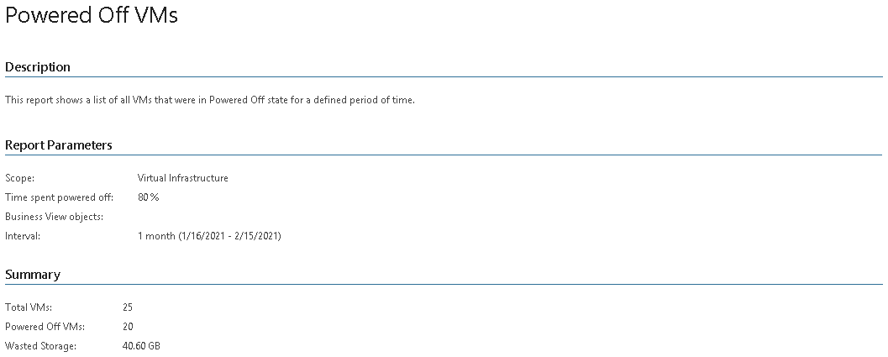
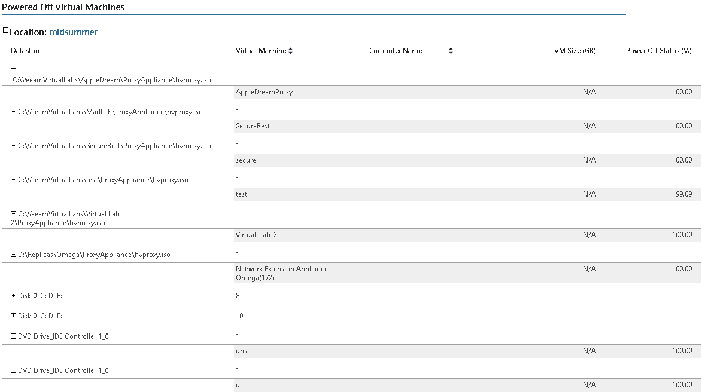

# Powered Off VMs (Hyper-V)

The report provides information on VMs powered off throughout a specified time period.

* The Summary section shows the total number of VMs in the selected scope, the number of powered off VMs and their total size on disk.
* The Powered Off Virtual Machines table lists powered off VMs, their location and disk size.

The Powered Off status (%) column displays the amount of time during which a VM was powered off against the time of the reporting period in percent.

Report Parameters

You can specify the following report parameters:

* Infrastructure objects: defines a virtual infrastructure level and its sub-components to analyze in the report.
* Business View objects: defines Business View groups to analyze in the report. The parameter options are limited to objects of the Virtual Machine type.

Business View groups from the same category are joined using Boolean OR operator, Business View groups from different categories are joined using Boolean AND operator. That is, if you select groups from the same category, the report will contain all objects that are included in groups. However, if you select groups from different categories, the report will contain only objects that are included in all selected groups.

* Period: defines the time period to analyze in the report. Note that the reporting period must include at least one successfully completed Object properties data collection task for the selected scope. Otherwise, the report will contain no data.
* Time spent powered off: defines the threshold for the amount of time when a VM was powered off against the amount of time in the reporting period (in percentage). If the time during which a VM was powered off is less than the specified value in percent, the report will not analyze this VM.

Use Case

The report allows you to track VMs that have been in the powered off state for a specified time period. Since powered off VMs consume space required to store their disks and configuration data, you can review storage usage and relocate these machines, or decommission machines that you no longer need.

