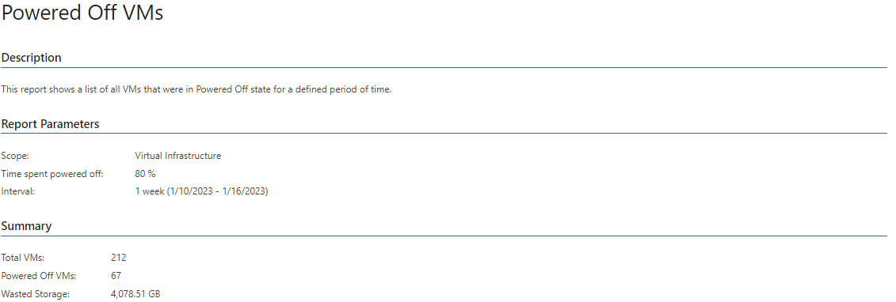

# Powered Off VMs (vSphere)

This report shows a list of VMs that were remaining in the powered off state during the specified period.

For each powered off VM, the report shows its location, size and the datastore where the VM files are stored.

* The Summary section shows the total number of VMs in the selected scope, the number of powered off VMs and their total size on disk.
* The Powered Off Virtual Machines table lists powered off VMs, their location and disk size.

The Powered Off status (%) column displays the amount of time during which a VM was powered off against the time of the reporting period in percent.

Report Parameters

You can specify the following report parameters:

* Infrastructure objects: defines a virtual infrastructure level and its sub-components to analyze in the report.
* VMware Cloud Director objects: defines VMware Cloud Director components to analyze in the report.
* Business View objects: defines Business View groups to analyze in the report. The parameter options are limited to objects of the Virtual Machine type.

Business View groups from the same category are joined using Boolean OR operator, Business View groups from different categories are joined using Boolean AND operator. That is, if you select groups from the same category, the report will contain all objects that are included in groups. However, if you select groups from different categories, the report will contain only objects that are included in all selected groups.

* Last <N>: defines the time period to analyze in the report. Note that the reporting period must include at least one successfully completed Object properties data collection task for the selected scope. Otherwise, the report will contain no data.
* Time spent powered off: defines the amount of time when the VM was powered off against the amount of time in the reporting period (in percentage).

Use Case

Powered off VMs do not consume CPU, memory or network resources, but they take up storage space required to accommodate their disk files, snapshots and configuration data.

The report helps you detect VMs that can be relocated to less costly datastores and identify neglected VMs that can be decommissioned.

