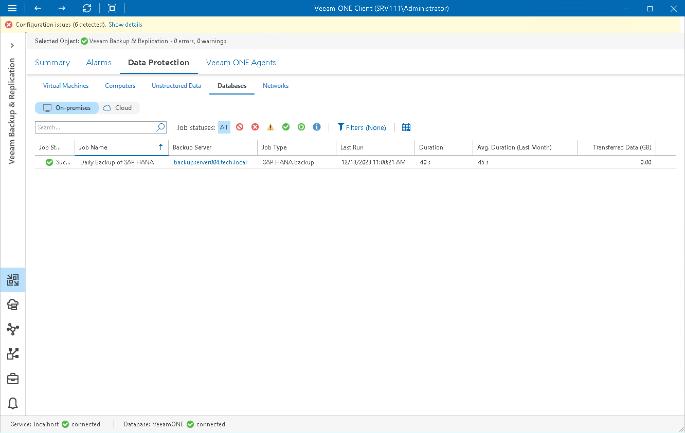
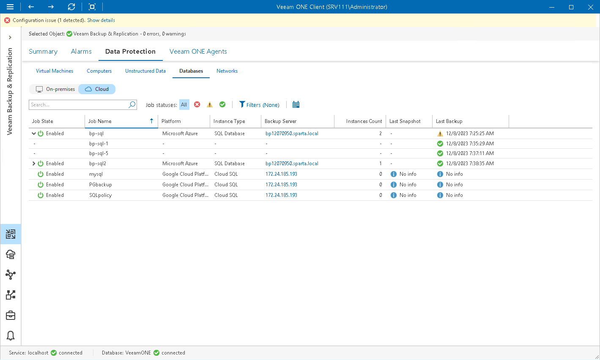

# Databases

Veeam ONE Client allows you to track database jobs and policies configured to protect [on-premises](#onprem) and [cloud](#cloud) databases.

You can track real-time job statistics at different levels of your backup infrastructure:

* Jobs managed by a specific backup server
* Jobs on all backup servers controlled by Veeam Backup Enterprise Manager
* All jobs across the entire backup infrastructure

Viewing Database Job Details

To view the list of database protection jobs at the necessary backup infrastructure level:

1. Open Veeam ONE Client.

For details, see [Accessing Veeam ONE Components](access.md).

1. At the bottom of the inventory pane, click Veeam Backup & Replication.
2. In the inventory pane, select the necessary backup infrastructure node.
3. Open the Data Protection tab and navigate to Databases > On-premises.
4. To find the necessary job, you can use filters at the top of the job list:

* To show or hide jobs that ended with a specific status, use the status buttons at the top of the list (Show all jobs, Show disabled jobs, Show failed jobs, Show jobs with warnings, Show successful jobs, Show running jobs or Show jobs with no status).
* To show or hide jobs of a specific type, use the job type filter at the top of the list (Backup policy, Backup copy, Transaction log backup).
* To show or hide jobs for a specific platform, use the platform filter at the top of the list (Oracle Database, SAP HANA, SAP on Oracle Database, Microsoft SQL Server, SAP on MaxDB)
* To set the time interval when jobs ran for the last time, use the Filter jobs by time period button. Release the button to discard the time period filter.
* To find jobs by name, use the search field at the top of the list.

The list of jobs shows all policies, backup copy and transaction log backup jobs for the backup infrastructure level that you selected in the inventory pane.

Each job in the list is described with a set of properties. To show or hide properties, right-click the list header and choose properties that must be displayed.

* Job Status — the latest status of the job session (Success, Warning, Failed, Running, or jobs with no status).
* Job Name — name of the database protection job.
* Backup Server — name of a backup server on which the job is configured. Click the server name link to drill down to the list of alarms for the chosen backup server.
* Job Type — type of the database protection job (Backup policy, Backup copy, Transaction log backup)
* Last Run — date and time of the latest job run.

* Duration — time taken to complete the job during its latest run.
* Avg. Duration (Last Month) — average time taken to complete the job (total job duration time for the previous month divided by the number of times the job ran).
* Transferred Data (GB) — amount of backup data that was transferred to the target destination during the latest job run.

|  |
| --- |
| Note: |
| The “No info” label indicates that no information is available for the job because data has not been collected yet. |

Viewing Cloud Database Job Details

To view the list of database protection jobs at the necessary backup infrastructure level:

1. Open Veeam ONE Client.

For details, see [Accessing Veeam ONE Components](access.md).

1. At the bottom of the inventory pane, click Veeam Backup & Replication.
2. In the inventory pane, select the necessary backup infrastructure node.
3. Open the Data Protection tab and navigate to Databases > Cloud.
4. To find the necessary job, you can use filters at the top of the job list:

* To show or hide jobs that ended with a specific status, use the status buttons at the top of the list (Show all jobs, Show jobs with errors, Show jobs with warnings, Show successful jobs).
* To show or hide jobs for a specific platform, use the platform filter at the top of the list (AWS, Microsoft Azure, Google Cloud Platform)
* To set the time interval when jobs ran for the last time, use the Filter jobs by time period button. Release the button to discard the time period filter.
* To find jobs by name, use the search field at the top of the list.

The list of jobs shows all database protection jobs for the backup infrastructure level that you selected in the inventory pane.

Each job in the list is described with a set of properties. To show or hide properties, right-click the list header and choose properties that must be displayed.

* Job State — state of the Microsoft Azure SQL Database, AWS RDS or Google Cloud SQL policy schedule (Enabled, Disabled).

Click the > icon to show details of the last cloud protection sessions based on a specific policy.

* Job Name — name of the Microsoft Azure SQL Database, AWS RDS or Google Cloud SQL policy.
* Platform — name of the cloud platform for which policy is configured.
* Instance Type — type of the protected instance.
* Backup Server — name of a backup server to which external repository with cloud backups is connected.

Click the server name link to drill down to the list of alarms for a chosen backup server.

* Instances Count — number of Microsoft Azure SQL Database, AWS RDS or Google Cloud SQL instances processed during the last cloud protection session.
* Last Snapshot — date and time when the latest cloud-native snapshot was created for the AWS RDS or Google Cloud SQL instance.
* Last Backup — date and time of the latest backup restore point was created for the Microsoft Azure SQL Database or Google Cloud SQL instance.
* Last Replication — date and time of the latest replication restore point was created for the AWS RDS instance.
* Last Archive — date and time of the latest archive restore point was created for the Microsoft Azure SQL Database or Google Cloud SQL instance.
* Instance ID — id of the Microsoft Azure SQL Database, AWS RDS or Google Cloud SQL instance.

|  |
| --- |
| Note: |
| The “No info” label indicates that no information is available for the job because data has not been collected yet. |

