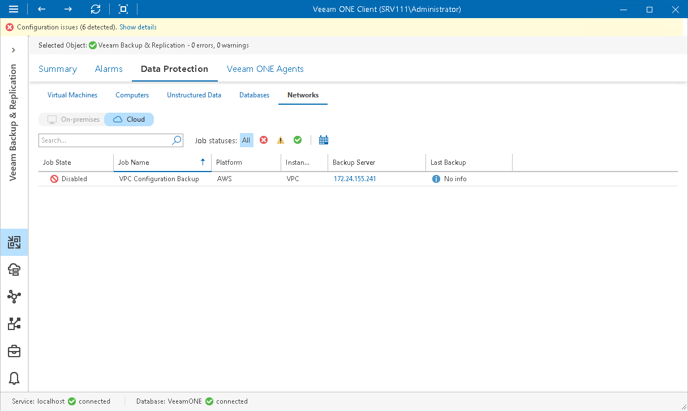

# Networks

Veeam ONE Client allows you to track AWS policies configured to protect cloud networks.

You can track real-time job statistics at different levels of your backup infrastructure:

* Jobs managed by a specific backup server
* Jobs on all backup servers controlled by Veeam Backup Enterprise Manager
* All jobs across the entire backup infrastructure

To view the list of network protection policies at the necessary backup infrastructure level:

1. Open Veeam ONE Client.

For details, see [Accessing Veeam ONE Components](access.md).

1. At the bottom of the inventory pane, click Veeam Backup & Replication.
2. In the inventory pane, select the necessary backup infrastructure node.
3. Open the Data Protection tab and navigate to Networks.
4. To find the necessary job, you can use filters at the top of the job list:

* To show or hide jobs that ended with a specific status, use the status buttons at the top of the list (Show all policies, Show policies with errors, Show policies with warnings, Show successful policies).
* To set the time interval when jobs ran for the last time, use the Filter jobs by time period button. Release the button to discard the time period filter.
* To find jobs by name, use the search field at the top of the list.

The list of jobs shows all policies for the backup infrastructure level that you selected in the inventory pane.

Each job in the list is described with a set of properties. To show or hide properties, right-click the list header and choose properties that must be displayed.

* Job State — state of the cloud policy schedule (Enabled, Disabled).

Click the > icon to show details of the last cloud protection sessions based on a specific policy.

* Job Name — name of the cloud backup policy.
* Platform — name of the cloud platform for which policy is configured.
* Instance Type — type of the protected instance.
* Backup Server — name of the backup server to which external repository with cloud backups is connected.

Click the server name link to drill down to the list of alarms for a chosen backup server.

* Last Backup — date and time when the latest backup restore point was created for a cloud instance.

|  |
| --- |
| Note: |
| The “No info” label indicates that no information is available for the job because data has not been collected yet. |

