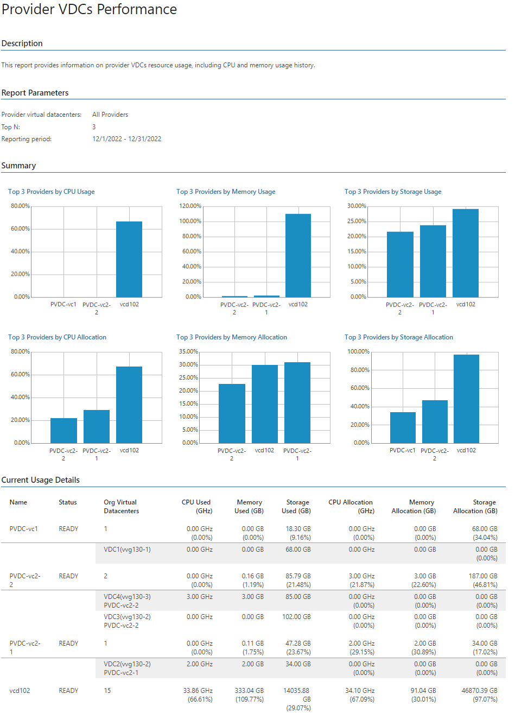
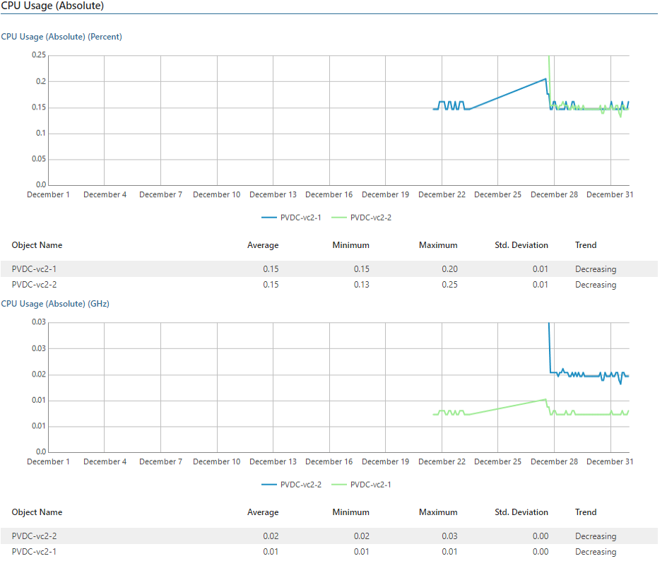

# Provider VDCs Performance

This report aggregates historical data and shows performance statistics for selected provider virtual datacenters across a time range.

* The Summary section includes Top N charts that display provider virtual datacenters with the largest amount of allocated resources and the highest level of CPU, memory and storage utilization.

* The Current Usage Details section shows general configuration data for the selected provider virtual datacenters.

* The Performance Charts section displays tables and performance charts with resource usage statistics for each provider virtual datacenter included in the report scope.

Report Parameters

You can specify the following report parameters:

* Provider virtual datacenters: defines a list of provider virtual datacenters to analyze in the report.
* Period: defines the time period to analyze in the report.
* Business hours only: defines time of a day for which historical performance data will be used to calculate the performance trend. All data beyond this interval will be excluded from the baseline used for data analysis.
* Top N: defines the maximum number of provider virtual datacenters to display in the report output.

Use Case

The report helps you identify provider virtual datacenters with performance issues, balance workloads and optimize resource allocation.

Page updated 2026-08-05

