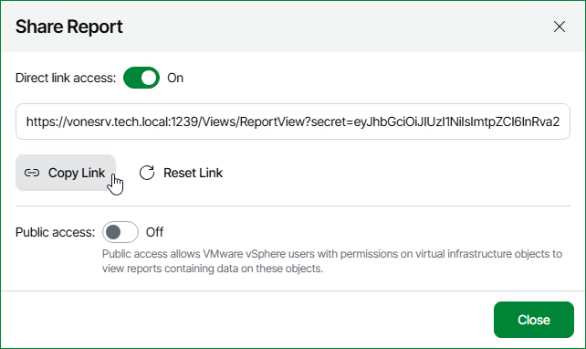

# Sharing Reports

To share a saved report with other users or integrate the report to a web portal, you can enable public access to the report or generate a direct report link.

Before you share a report with other users, make sure that you have saved the report to My Reports. For details, see [Saving Reports](save_reports.md).

Generating Direct Report Link

To share a report with other users, or integrate a report to a web portal, you can generate a direct report link:

1. Open Veeam ONE Web Client.
2. Open the Saved Reports tab.
3. In the report screen, select the necessary report.
4. In the displayed list of reports, click a saved report for which you want to generate a direct link.
5. At the top of the report parameters, right-click the necessary report and select Share in the context menu.
6. In the Share Report window, switch the Direct link access toggle to On.
7. Click Copy Link to copy the link and use it to share with other users or integrate to web portals.
8. If you need to generate a new direct link, click Reset Link.

Note that after you change the direct link, the previous link will become invalid.

1. Click Close.

Enabling Public Access

To share a report with other users, you must enable public access to this report. Veeam ONE users, including VMware vSphere users who have permissions assigned on virtual infrastructure objects, can access published reports in the Veeam ONE Web Client.

To enable public access to a report:

1. Open Veeam ONE Web Client.
2. Open the Saved Reports tab.
3. In the displayed list of reports, click a saved report for which you want to enable public access.
4. At the top of the report parameters, right-click the necessary report and select Share in the context menu.
5. In the Share Report window, switch the Public access toggle to On.
6. Click Close.

Disabling Public Access

To make a published report inaccessible, you can disable public access to the report:

1. Open Veeam ONE Web Client.
2. Open the Saved Reports tab.
3. In the report screen, select the necessary folder.
4. In the displayed list of reports, click a saved report for which you want to disable public access.
5. At the top of the report parameters, right-click the necessary report and select Share in the context menu.
6. In the Share Report window, switch the Public access toggle to Off.
7. Click Close.

